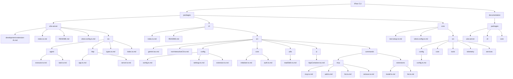

```mermaid
graph TD
    A[iFlow CLI] --> B[packages]
    A --> C[documentation]
    
    B --> B1[a2a-server]
    B --> B2[cli]
    B --> B3[core]
    
    B1 --> B1_1[development-extension-rfc.md]
    B1 --> B1_2[index.ts.md]
    B1 --> B1_3[README.md]
    B1 --> B1_4[vitest.config.ts.md]
    B1 --> B1_5[src]
    
    B1_5 --> B1_5_1[agent]
    B1_5 --> B1_5_2[http]
    B1_5 --> B1_5_3[types.ts.md]
    B1_5 --> B1_5_4[index.ts.md]
    
    B1_5_1 --> B1_5_1_1[executor.ts.md]
    B1_5_1 --> B1_5_1_2[task.ts.md]
    
    B1_5_2 --> B1_5_2_1[app.ts.md]
    B1_5_2 --> B1_5_2_2[server.ts.md]
    
    B2 --> B2_1[index.ts.md]
    B2 --> B2_2[README.md]
    B2 --> B2_3[src]
    
    B2_3 --> B2_3_1[gemini.tsx.md]
    B2_3 --> B2_3_2[nonInteractiveCli.ts.md]
    B2_3 --> B2_3_3[config]
    B2_3 --> B2_3_4[core]
    B2_3 --> B2_3_5[utils]
    B2_3 --> B2_3_6[ui]
    B2_3 --> B2_3_7[commands]
    
    B2_3_3 --> B2_3_3_1[config.ts.md]
    B2_3_3 --> B2_3_3_2[settings.ts.md]
    B2_3_3 --> B2_3_3_3[extension.ts.md]
    
    B2_3_4 --> B2_3_4_1[initializer.ts.md]
    B2_3_4 --> B2_3_4_2[auth.ts.md]
    
    B2_3_5 --> B2_3_5_1[readStdin.ts.md]
    
    B2_3_6 --> B2_3_6_1[AppContainer.tsx.md]
    
    B2_3_7 --> B2_3_7_1[mcp]
    B2_3_7 --> B2_3_7_2[extensions]
    
    B2_3_7_1 --> B2_3_7_1_1[mcp.ts.md]
    B2_3_7_1 --> B2_3_7_1_2[add.ts.md]
    B2_3_7_1 --> B2_3_7_1_3[list.ts.md]
    B2_3_7_1 --> B2_3_7_1_4[remove.ts.md]
    
    B2_3_7_2 --> B2_3_7_2_1[install.ts.md]
    B2_3_7_2 --> B2_3_7_2_2[list.ts.md]
    
    B3 --> B3_1[test-setup.ts.md]
    B3 --> B3_2[vitest.config.ts.md]
    B3 --> B3_3[src]
    
    B3_3 --> B3_3_1[config]
    B3_3 --> B3_3_2[core]
    B3_3 --> B3_3_3[tools]
    B3_3 --> B3_3_4[telemetry]
    B3_3 --> B3_3_5[services]
    
    B3_3_1 --> B3_3_1_1[config.ts.md]
    
    C --> C1[packages]
    C1 --> C1_1[a2a-server]
    C1 --> C1_2[cli]
    C1 --> C1_3[core]
```