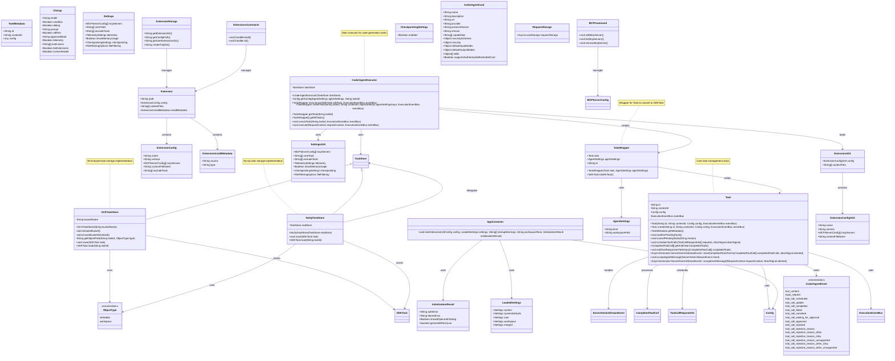

```mermaid
classDiagram
    %% A2A Server Package
    class TaskWrapper {
        +Task task
        +AgentSettings agentSettings
        +String id
        +TaskWrapper(Task task, AgentSettings agentSettings)
        +SDKTask toSDKTask()
    }
    
    class CoderAgentExecutor {
        -TaskStore taskStore
        +CoderAgentExecutor(TaskStore taskStore)
        -Config getConfig(AgentSettings agentSettings, String taskId)
        +TaskWrapper reconstruct(SDKTask sdkTask, ExecutionEventBus eventBus)
        +TaskWrapper createTask(String taskId, String contextId, AgentSettings agentSettingsInput, ExecutionEventBus eventBus)
        +TaskWrapper getTask(String taskId)
        +TaskWrapper[] getAllTasks()
        +void cancelTask(String taskId, ExecutionEventBus eventBus)
        +void execute(RequestContext requestContext, ExecutionEventBus eventBus)
    }
    
    class Task {
        -String id
        -String contextId
        -Config config
        -ExecutionEventBus eventBus
        +Task(String id, String contextId, Config config, ExecutionEventBus eventBus)
        +Task create(String id, String contextId, Config config, ExecutionEventBus eventBus)
        +TaskMetadata getMetadata()
        +void waitForPendingTools()
        +void cancelPendingTools(String reason)
        +void scheduleToolCalls(ToolCallRequestInfo[] requests, AbortSignal abortSignal)
        +CompletedToolCall[] getAndClearCompletedTools()
        +void addToolResponsesToHistory(CompletedToolCall[] completedTools)
        +AsyncGenerator~ServerGeminiStreamEvent~ sendCompletedToolsToLlm(CompletedToolCall[] completedToolCalls, AbortSignal aborted)
        +void acceptAgentMessage(ServerGeminiStreamEvent event)
        +AsyncGenerator~ServerGeminiStreamEvent~ acceptUserMessage(RequestContext requestContext, AbortSignal aborted)
    }
    
    class GCSTaskStore {
        -String bucketName
        +GCSTaskStore(String bucketName)
        -void initializeBucket()
        -void ensureBucketInitialized()
        -String getObjectPath(String taskId, ObjectType type)
        +void save(SDKTask task)
        +SDKTask load(String taskId)
    }
    
    class NoOpTaskStore {
        -TaskStore realStore
        +NoOpTaskStore(TaskStore realStore)
        +void save(SDKTask task)
        +SDKTask load(String taskId)
    }
    
    class AgentSettings {
        +String kind
        +String workspacePath
    }
    
    class TaskMetadata {
        +String id
        +String contextId
        +any config
    }
    
    %% CLI Package - Config
    class CliArgs {
        +String model
        +Boolean sandbox
        +Boolean debug
        +String prompt
        +Boolean allFiles
        +String approvalMode
        +Boolean telemetry
        +String[] extensions
        +Boolean listExtensions
        +Boolean screenReader
    }
    
    class Settings {
        +MCPServerConfig[] mcpServers
        +String[] coreTools
        +String[] excludeTools
        +TelemetrySettings telemetry
        +Boolean showMemoryUsage
        +CheckpointingSettings checkpointing
        +FileFilteringOptions fileFiltering
    }
    
    class LoadedSettings {
        +Settings system
        +Settings systemDefaults
        +Settings user
        +Settings workspace
        +Settings merged
    }
    
    %% CLI Package - Extensions
    class Extension {
        +String path
        +ExtensionConfig config
        +String[] contextFiles
        +ExtensionInstallMetadata installMetadata
    }
    
    class ExtensionConfig {
        +String name
        +String version
        +MCPServerConfig[] mcpServers
        +String contextFileName
        +String[] excludeTools
    }
    
    class ExtensionInstallMetadata {
        +String source
        +String type
    }
    
    class ExtensionStorage {
        +String getExtensionDir()
        +String getConfigPath()
        +String getUserExtensionsDir()
        +String createTmpDir()
    }
    
    %% CLI Package - Core
    class InitializationResult {
        +String authError
        +String themeError
        +Boolean shouldOpenAuthDialog
        +Number geminiMdFileCount
    }
    
    %% CLI Package - UI
    class AppContainer {
        +void startInteractiveUI(Config config, LoadedSettings settings, String[] startupWarnings, String workspaceRoot, InitializationResult initializationResult)
    }
    
    %% CLI Package - Commands
    class MCPCommand {
        +void addMcpServer()
        +void listMcpServers()
        +void removeMcpServer()
    }
    
    class ExtensionsCommand {
        +void handleInstall()
        +void handleList()
    }
    
    %% A2A Server Package - Config
    class ExtensionConfigA2A {
        +String name
        +String version
        +MCPServerConfig[] mcpServers
        +String contextFileName
    }
    
    class ExtensionA2A {
        +ExtensionConfigA2A config
        +String[] contextFiles
    }
    
    class SettingsA2A {
        +MCPServerConfig[] mcpServers
        +String[] coreTools
        +String[] excludeTools
        +TelemetrySettings telemetry
        +Boolean showMemoryUsage
        +CheckpointingSettings checkpointing
        +FileFilteringOptions fileFiltering
    }
    
    class CheckpointingSettings {
        +Boolean enabled
    }
    
    %% A2A Server Package - HTTP
    class CoderAgentCard {
        +String name
        +String description
        +String url
        +String provider
        +String protocolVersion
        +String version
        +String[] capabilities
        +Object securitySchemes
        +Object security
        +Object defaultInputModes
        +Object defaultOutputModes
        +Object[] skills
        +Boolean supportsAuthenticatedExtendedCard
    }
    
    %% A2A Server Package - Persistence
    class ObjectType {
        <<enumeration>>
        metadata
        workspace
    }
    
    %% A2A Server Package - Types
    class CoderAgentEvent {
        <<enumeration>>
        text_content
        input_request
        tool_call_scheduled
        tool_call_update
        tool_call_completed
        tool_call_failed
        tool_call_canceled
        tool_call_waiting_for_approval
        tool_call_approved
        tool_call_rejected
        tool_call_rejection_reason
        tool_call_rejection_reason_other
        tool_call_rejection_reason_risky
        tool_call_rejection_reason_unsupported
        tool_call_rejection_reason_other_risky
        tool_call_rejection_reason_other_unsupported
    }
    
    %% A2A Server Package - Utils
    class RequestStorage {
        +AsyncLocalStorage requestStorage
    }
    
    %% Relationships
    TaskWrapper --> Task : wraps
    TaskWrapper --> AgentSettings : uses
    CoderAgentExecutor --> TaskWrapper : creates
    CoderAgentExecutor --> TaskStore : uses
    Task --> Config : uses
    Task --> ExecutionEventBus : uses
    GCSTaskStore --> SDKTask : stores
    NoOpTaskStore --> TaskStore : delegates
    NoOpTaskStore --> SDKTask : stores
    Extension --> ExtensionConfig : contains
    Extension --> ExtensionInstallMetadata : contains
    ExtensionStorage --> Extension : manages
    AppContainer --> Config : uses
    AppContainer --> LoadedSettings : uses
    AppContainer --> InitializationResult : uses
    MCPCommand --> MCPServerConfig : manages
    ExtensionsCommand --> Extension : manages
    ExtensionA2A --> ExtensionConfigA2A : contains
    Task --> CoderAgentEvent : emits
    Task --> ToolCallRequestInfo : schedules
    Task --> CompletedToolCall : processes
    Task --> ServerGeminiStreamEvent : handles
    CoderAgentExecutor --> ExtensionA2A : loads
    CoderAgentExecutor --> SettingsA2A : uses
    GCSTaskStore --> ObjectType : uses
    NoOpTaskStore --> ObjectType : uses
    
    %% Inheritance
    TaskStore <|-- GCSTaskStore
    TaskStore <|-- NoOpTaskStore
    
    %% Notes
    note for TaskWrapper "Wrapper for Task to convert to SDKTask"
    note for CoderAgentExecutor "Main executor for code generation tasks"
    note for Task "Core task management class"
    note for GCSTaskStore "GCS-based task storage implementation"
    note for NoOpTaskStore "No-op task storage implementation"
```