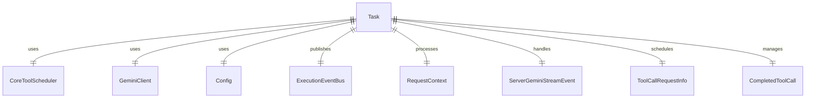
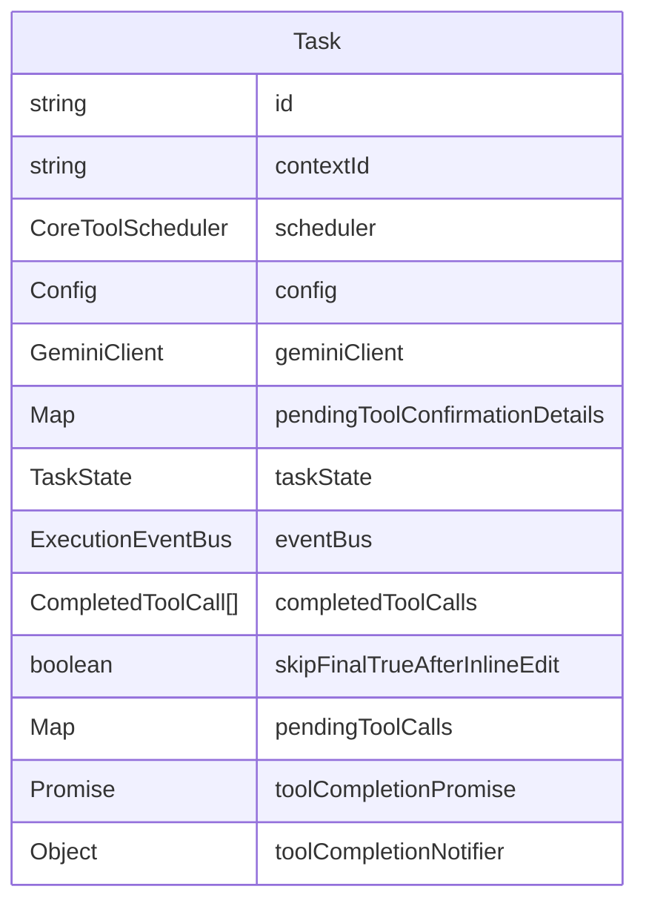

# src/agent/task.ts

这个文件实现了 Task 类，负责处理代理任务的核心逻辑。

## 主要功能

### Task 类

Task 类负责管理单个代理任务的执行，包括工具调度、状态管理、事件处理等。

#### 构造函数

```typescript
private constructor(
  id: string,
  contextId: string,
  config: Config,
  eventBus?: ExecutionEventBus,
)
```

参数：
- `id`: 任务 ID
- `contextId`: 上下文 ID
- `config`: 配置对象
- `eventBus`: 执行事件总线（可选）

#### 静态方法

##### `create`

```typescript
static async create(
  id: string,
  contextId: string,
  config: Config,
  eventBus?: ExecutionEventBus,
): Promise<Task>
```

创建新任务实例。

参数：
- `id`: 任务 ID
- `contextId`: 上下文 ID
- `config`: 配置对象
- `eventBus`: 执行事件总线（可选）

返回：
- Promise<Task>: 任务实例

#### 方法

##### `getMetadata`

```typescript
async getMetadata(): Promise<TaskMetadata>
```

获取任务元数据。

返回：
- Promise<TaskMetadata>: 任务元数据

##### 工具调用相关方法

- `waitForPendingTools(): Promise<void>` - 等待待处理的工具调用完成
- `cancelPendingTools(reason: string): void` - 取消待处理的工具调用
- `scheduleToolCalls(requests: ToolCallRequestInfo[], abortSignal: AbortSignal): Promise<void>` - 调度工具调用
- `getAndClearCompletedTools(): CompletedToolCall[]` - 获取并清除已完成的工具调用
- `addToolResponsesToHistory(completedTools: CompletedToolCall[]): void` - 将工具响应添加到历史记录
- `sendCompletedToolsToLlm(completedToolCalls: CompletedToolCall[], aborted: AbortSignal): AsyncGenerator<ServerGeminiStreamEvent>` - 将已完成的工具调用发送给 LLM

##### 消息处理方法

- `acceptAgentMessage(event: ServerGeminiStreamEvent): Promise<void>` - 接受代理消息
- `acceptUserMessage(requestContext: RequestContext, aborted: AbortSignal): AsyncGenerator<ServerGeminiStreamEvent>` - 接受用户消息

##### 状态管理方法

- `setTaskStateAndPublishUpdate(...)`: 设置任务状态并发布更新
- `_sendTextContent(content: string): void` - 发送文本内容
- `_sendThought(content: ThoughtSummary): void` - 发送思考内容

##### 私有方法

- `_resetToolCompletionPromise(): void` - 重置工具完成 Promise
- `_registerToolCall(toolCallId: string, status: string): void` - 注册工具调用
- `_resolveToolCall(toolCallId: string): void` - 解析工具调用
- `_createTextMessage(text: string, role: 'agent' | 'user' = 'agent'): Message` - 创建文本消息
- `_createStatusUpdateEvent(...)` - 创建状态更新事件
- `_schedulerOutputUpdate(toolCallId: string, outputChunk: string): void` - 调度器输出更新
- `_schedulerAllToolCallsComplete(completedToolCalls: CompletedToolCall[]): Promise<void>` - 所有工具调用完成
- `_schedulerToolCallsUpdate(toolCalls: ToolCall[]): void` - 工具调用更新
- `createScheduler(): CoreToolScheduler` - 创建调度器
- `toolStatusMessage(tc: ToolCall, taskId: string, contextId: string): Message` - 工具状态消息
- `getProposedContent(file_path: string, old_string: string, new_string: string): Promise<string>` - 获取提议的内容
- `_applyReplacement(currentContent: string | null, oldString: string, newString: string, isNewFile: boolean): string` - 应用替换
- `_handleToolConfirmationPart(part: Part): Promise<boolean>` - 处理工具确认部分

## 函数级调用关系



## 变量级调用关系

