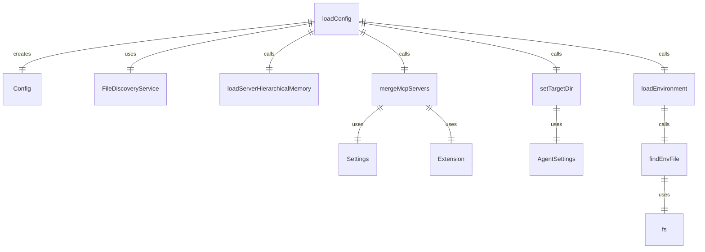
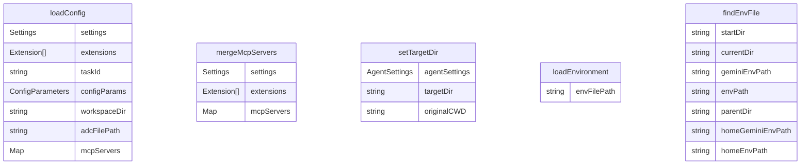

# src/config/config.ts

这个文件负责加载和管理代理的配置信息。

## 主要功能

### loadConfig 函数

```typescript
export async function loadConfig(
  settings: Settings,
  extensions: Extension[],
  taskId: string,
): Promise<Config>
```

加载配置信息。

参数：
- `settings`: 设置对象
- `extensions`: 扩展数组
- `taskId`: 任务 ID

返回：
- Promise<Config>: 配置对象

### mergeMcpServers 函数

```typescript
export function mergeMcpServers(settings: Settings, extensions: Extension[])
```

合并 MCP 服务器配置。

参数：
- `settings`: 设置对象
- `extensions`: 扩展数组

返回：
- 合并后的 MCP 服务器配置

### setTargetDir 函数

```typescript
export function setTargetDir(agentSettings: AgentSettings | undefined): string
```

设置目标目录。

参数：
- `agentSettings`: 代理设置（可选）

返回：
- string: 目标目录路径

### loadEnvironment 函数

```typescript
export function loadEnvironment(): void
```

加载环境变量。

### findEnvFile 函数

```typescript
function findEnvFile(startDir: string): string | null
```

查找环境变量文件。

参数：
- `startDir`: 起始目录

返回：
- string | null: 环境变量文件路径或 null

## 函数级调用关系



## 变量级调用关系

