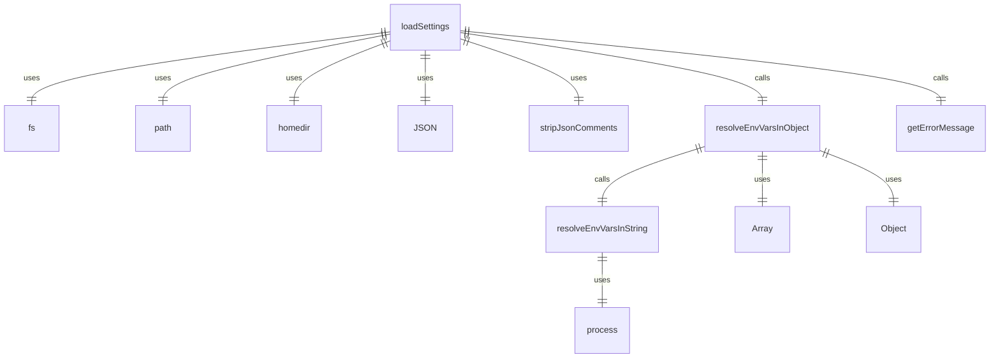
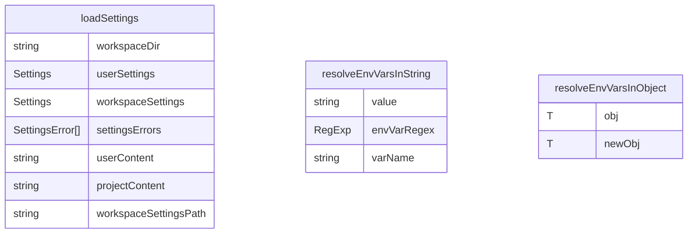

# src/config/settings.ts

这个文件负责加载和管理设置配置。

## 主要类型和接口

### Settings 接口

表示设置的接口，包含：
- `mcpServers`: MCP 服务器配置（可选）
- `coreTools`: 核心工具数组（可选）
- `excludeTools`: 排除工具数组（可选）
- `telemetry`: 遥测设置（可选）
- `showMemoryUsage`: 显示内存使用情况（可选）
- `checkpointing`: 检查点设置（可选）
- `fileFiltering`: 文件过滤设置（可选）

### SettingsError 接口

表示设置错误的接口，包含：
- `message`: 错误消息
- `path`: 错误路径

### CheckpointingSettings 接口

表示检查点设置的接口，包含：
- `enabled`: 是否启用（可选）

## 主要功能

### loadSettings 函数

```typescript
export function loadSettings(workspaceDir: string): Settings
```

加载设置。

参数：
- `workspaceDir`: 工作区目录

返回：
- Settings: 设置对象

### resolveEnvVarsInString 函数

```typescript
function resolveEnvVarsInString(value: string): string
```

解析字符串中的环境变量。

参数：
- `value`: 字符串值

返回：
- string: 解析后的字符串

### resolveEnvVarsInObject 函数

```typescript
function resolveEnvVarsInObject<T>(obj: T): T
```

解析对象中的环境变量。

参数：
- `obj`: 对象

返回：
- T: 解析后的对象

## 常量

- `SETTINGS_DIRECTORY_NAME`: 设置目录名
- `USER_SETTINGS_DIR`: 用户设置目录
- `USER_SETTINGS_PATH`: 用户设置文件路径

## 函数级调用关系



## 变量级调用关系

