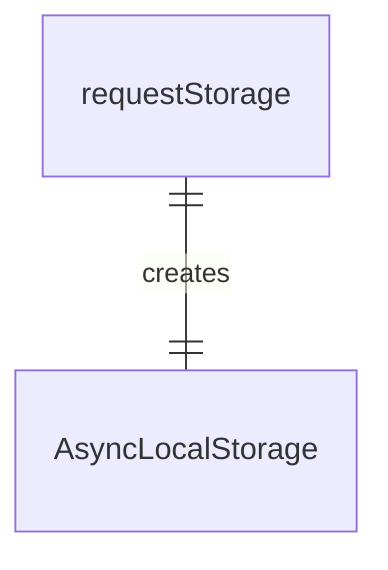
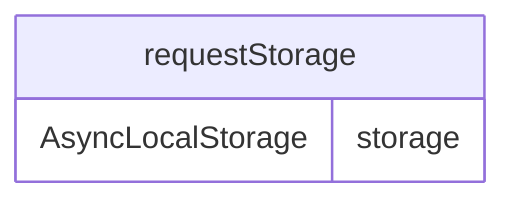

# src/http/requestStorage.ts

这个文件实现了请求存储功能，使用 AsyncLocalStorage 来存储请求上下文。

## 主要功能

### requestStorage 对象

```typescript
export const requestStorage = new AsyncLocalStorage<{ req: express.Request }>();
```

创建 AsyncLocalStorage 实例，用于存储请求上下文。

这个存储可以在异步操作期间保持请求对象的引用，使得在任何嵌套的异步函数中都能访问到原始的请求对象。

## 函数级调用关系



## 变量级调用关系

