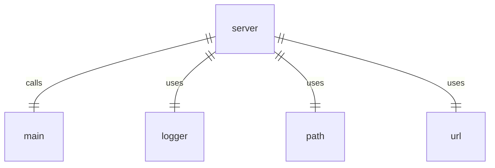

# server.ts

## 概述

`server.ts` 是 a2a-server 包的服务器入口文件。该文件负责启动和运行代理服务器应用，处理未捕获的异常，并确保应用的稳定运行。

## 功能详情

### 异常处理
- 注册 `uncaughtException` 事件监听器，捕获未处理的异常
- 记录错误日志并退出进程，确保应用不会在未处理异常状态下继续运行

### 应用启动
- 检查模块是否作为主脚本运行（而非被其他模块导入）
- 验证环境变量 `NODE_ENV` 不为 'test'，避免在测试环境中启动服务器
- 调用 `main()` 函数启动应用
- 处理 `main()` 函数中的未捕获错误，记录日志并退出进程

### 模块识别
- 使用 `import.meta.url` 和 `process.argv[1]` 确定当前模块是否为主模块
- 通过 `path.resolve()` 和 `url.fileURLToPath()` 处理跨平台路径兼容性

## 依赖模块

- `node:url`: Node.js URL 处理模块，用于将 import.meta.url 转换为文件路径
- `node:path`: Node.js 路径处理模块，用于路径解析和比较
- `../utils/logger.js`: 日志记录器，用于记录错误和信息
- `./app.js`: 应用主模块，包含 `main()` 函数

## 启动流程

1. 检查是否作为主模块运行
2. 注册全局异常处理器
3. 调用应用主函数 `main()`
4. 处理主函数中的错误并适当退出

## 设计考虑

该文件的设计确保了应用的健壮性：
- 通过全局异常处理防止应用崩溃
- 通过模块检查避免在被导入时意外启动服务器
- 通过环境变量检查避免在测试环境中启动实际服务器

## 函数级调用关系



## 变量级调用关系

```mermaid
erDiagram
    server {
        boolean isMainModule
        string process.argv[1]
        string import.meta.url
    }
```