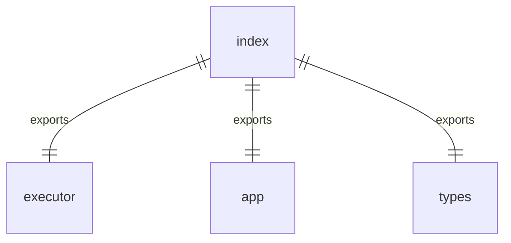

# src/index.ts

这个文件是 a2a-server 包的源代码入口点，它重新导出了几个核心模块。

## 功能

- 作为源代码的公共接口，导出所有需要暴露给外部使用的功能
- 简化了模块的使用方式，通过重新导出核心功能模块

## 导出内容

1. `./agent/executor.js` - 导出代理执行器相关功能
2. `./http/app.js` - 导出 HTTP 应用相关功能
3. `./types.js` - 导出类型定义

## 函数级调用关系

