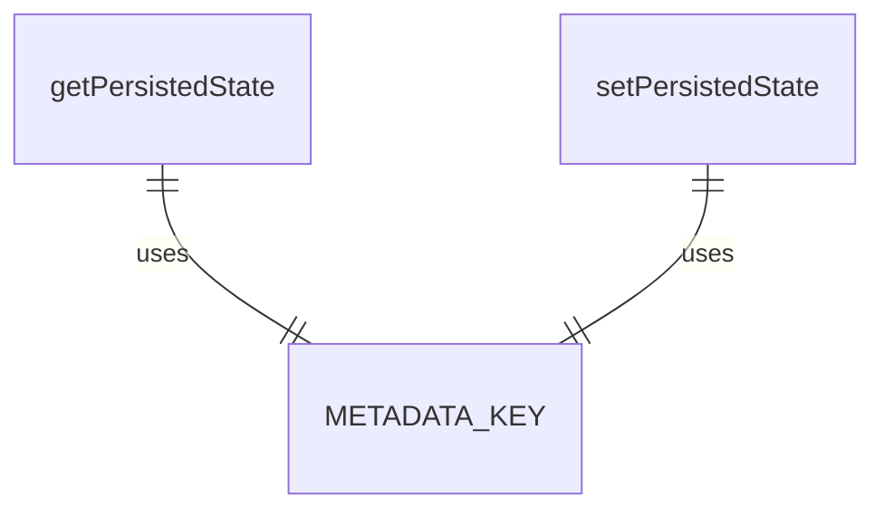
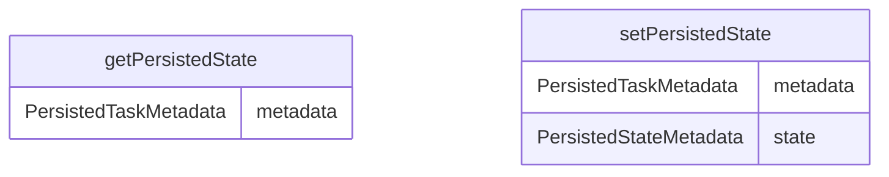

# src/types.ts

这个文件定义了 a2a-server 包中使用的各种类型和接口。

## 主要类型和接口

### CoderAgentEvent 枚举

定义了代理事件的类型：

- `ToolCallConfirmationEvent` - 请求一个或多个工具调用确认的事件
- `ToolCallUpdateEvent` - 更新一个或多个工具调用状态的事件
- `TextContentEvent` - 提供任务文本更新的事件
- `StateChangeEvent` - 指示任务执行状态变化的事件
- `StateAgentSettingsEvent` - 用户发送的启动代理的事件
- `ThoughtEvent` - 包含代理思考的事件

### AgentSettings 接口

表示代理设置的接口，包含：
- `kind`: 事件类型
- `workspacePath`: 工作区路径

### 其他事件接口

- `ToolCallConfirmation` - 工具调用确认事件
- `ToolCallUpdate` - 工具调用更新事件
- `TextContent` - 文本内容事件
- `StateChange` - 状态变更事件
- `Thought` - 思考事件

### 工具相关类型

- `ToolConfirmationResponse` - 工具确认响应
- `CoderAgentMessage` - 代理消息类型联合
- `TaskMetadata` - 任务元数据
- `PersistedStateMetadata` - 持久化状态元数据
- `PersistedTaskMetadata` - 持久化任务元数据

### 常量和函数

- `METADATA_KEY` - 持久化状态的键名
- `getPersistedState` - 获取持久化状态的函数
- `setPersistedState` - 设置持久化状态的函数

## 函数级调用关系

## 变量级调用关系

