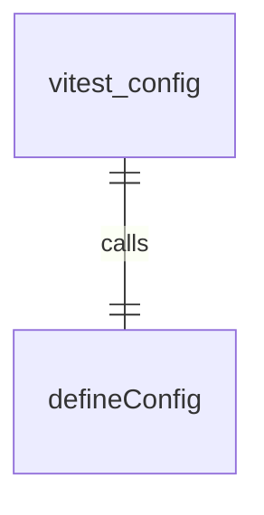
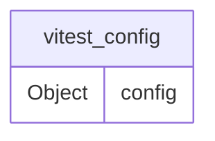

# vitest.config.ts

## 概述

`vitest.config.ts` 是 a2a-server 包的 Vitest 测试配置文件。Vitest 是一个基于 Vite 的单元测试框架，这个配置文件定义了测试运行的参数和行为。

## 配置详情

该配置文件导出一个 Vitest 配置对象，包含以下设置：

### 测试报告器
- `reporters`: 配置测试报告器为默认报告器和 JUnit 报告器
  - JUnit 报告器将测试结果输出到 `junit.xml` 文件

### 测试行为
- `passWithNoTests`: 允许在没有测试文件的情况下通过测试

### 代码覆盖率
- `provider`: 使用 V8 作为覆盖率提供者
- `reportsDirectory`: 覆盖率报告输出到 `./coverage` 目录
- `reporter`: 配置多种覆盖率报告格式：
  - `text`: 文本摘要报告，输出到 `full-text-summary.txt`
  - `html`: HTML 格式的详细报告
  - `json`: JSON 格式的报告
  - `lcov`: LCOV 格式的报告
  - `cobertura`: Cobertura XML 格式的报告
  - `json-summary`: JSON 摘要报告，输出到 `coverage-summary.json`

## 使用方式

该配置文件会被 Vitest 自动加载，用于配置测试运行环境。当运行 `npm test` 或 `vitest` 命令时，会使用此配置来执行测试和生成报告。

## 函数级调用关系

## 变量级调用关系

