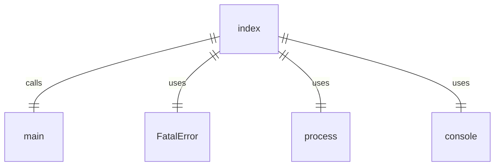
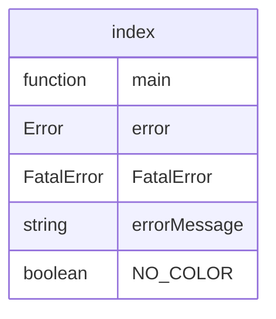

# index.ts

这个文件是CLI应用程序的入口点。

## 功能概述

1. 作为CLI应用程序的全局入口点
2. 导入并调用主函数
3. 处理未捕获的错误并优雅退出

## 代码结构

### 全局入口点
- 导入 `./src/gemini.js` 模块
- 调用 `main` 函数启动应用程序
- 使用 `.catch` 处理未捕获的错误

### 错误处理
- 检查错误是否为 `FatalError` 实例
- 如果是 `FatalError`，则根据环境变量决定是否添加颜色并输出错误信息，然后退出进程
- 如果不是 `FatalError`，则输出详细的错误信息和堆栈跟踪，然后退出进程

## 依赖关系

- 依赖 `./src/gemini.js` 中的 `main` 函数
- 依赖 `@google/gemini-cli-core` 中的 `FatalError`

## 函数级调用关系

## 变量级调用关系

