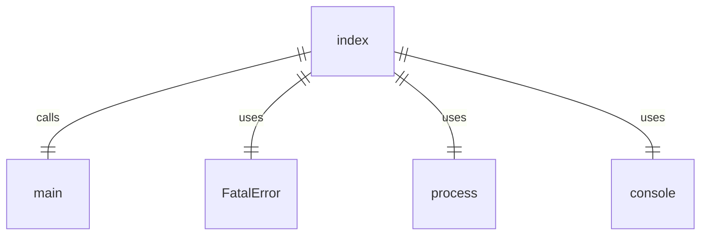
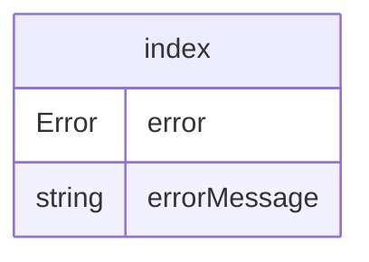

# index.ts

这是 Gemini CLI 的入口文件，负责启动整个应用程序。

## 功能概述

1. 导入并执行 `./src/gemini.js` 模块
2. 调用 `main` 函数启动应用
3. 处理全局错误和未捕获的异常

## 主要函数

### main()
- 启动 CLI 应用程序的主入口点
- 捕获并处理致命错误
- 根据错误类型进行不同的处理：
  - 如果是 `FatalError` 类型，显示错误信息并以相应退出码退出
  - 如果是其他错误，显示堆栈跟踪并以 1 退出

## 错误处理

- 使用 `FatalError` 类型来处理已知的致命错误
- 对于未知错误，显示完整的堆栈跟踪信息
- 支持通过 `NO_COLOR` 环境变量控制错误信息的颜色显示

## 函数级调用关系

## 变量级调用关系

