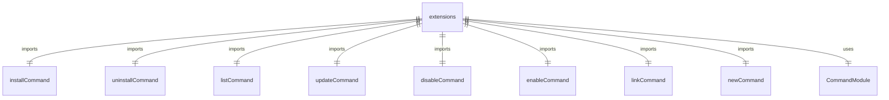
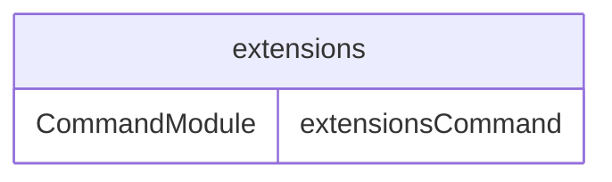

# extensions.tsx

扩展命令模块，用于管理 Gemini CLI 扩展。

## 功能概述

1. 注册扩展管理子命令
2. 提供扩展安装、卸载、更新等功能
3. 集成到主 CLI 命令系统

## 主要导出

### extensionsCommand: CommandModule
Yargs 命令模块，定义 extensions 命令：
- command: 'extensions <command>'
- describe: 'Manage Gemini CLI extensions'
- builder: 配置子命令
  - install: 安装扩展
  - uninstall: 卸载扩展
  - list: 列出扩展
  - update: 更新扩展
  - disable: 禁用扩展
  - enable: 启用扩展
  - link: 链接本地扩展
  - new: 创建新扩展
- handler: 命令处理器

## 子命令

### installCommand
安装扩展：
- 支持 Git 仓库（URL 或 "org/repo" 格式）
- 支持本地路径安装
- 自动启用安装的扩展

### uninstallCommand
卸载扩展：
- 按名称卸载扩展
- 从禁用列表中移除

### listCommand
列出已安装的扩展：
- 显示扩展名称和版本
- 显示扩展路径和源信息
- 显示上下文文件和 MCP 服务器信息

### updateCommand
更新扩展：
- 支持更新单个扩展
- 支持更新所有可更新的扩展
- 提供版本更新信息

### disableCommand
禁用扩展：
- 按名称禁用扩展
- 支持用户和工作区作用域

### enableCommand
启用扩展：
- 按名称启用扩展
- 从禁用列表中移除

### linkCommand
链接本地扩展：
- 创建到本地扩展目录的链接
- 便于开发和测试

### newCommand
创建新扩展：
- 生成扩展模板
- 创建基本的扩展结构

## 使用示例

```bash
# 安装扩展
gemini extensions install github.com/user/my-extension

# 列出所有扩展
gemini extensions list

# 更新扩展
gemini extensions update my-extension

# 卸载扩展
gemini extensions uninstall my-extension
```

## 函数级调用关系



## 变量级调用关系

