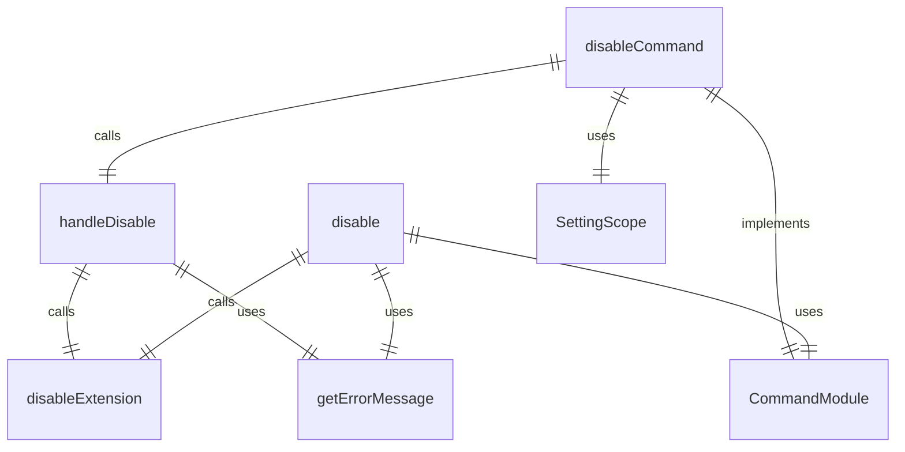
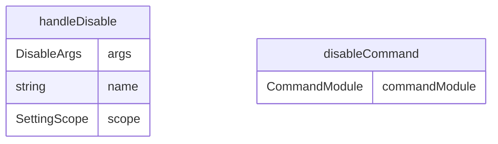

# disable.ts

扩展禁用命令，用于禁用已安装的 Gemini CLI 扩展。

## 功能概述

1. 禁用指定名称的扩展
2. 支持用户和工作区作用域
3. 提供禁用成功反馈

## 主要函数

### handleDisable(args: DisableArgs)
处理扩展禁用：
- 调用扩展禁用函数
- 提供禁用成功反馈
- 处理错误情况

参数：
- args.name: 要禁用的扩展名称
- args.scope: 禁用作用域（用户或工作区）

### disableCommand: CommandModule
Yargs 命令模块，定义 disable 子命令：
- command: 'disable [--scope] <name>'
- describe: 'Disables an extension.'
- builder: 参数构建器
  - name: 扩展名称（位置参数）
  - scope: 作用域（选项参数，默认为用户作用域）
- handler: 命令处理器，调用 handleDisable 函数

## 使用示例

```bash
# 禁用扩展（默认用户作用域）
gemini extensions disable my-extension

# 在工作区作用域禁用扩展
gemini extensions disable my-extension --scope workspace
```

## 函数级调用关系



## 变量级调用关系

