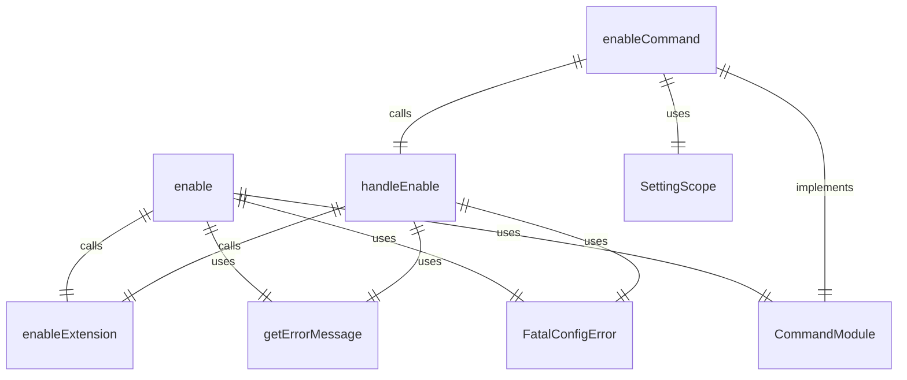
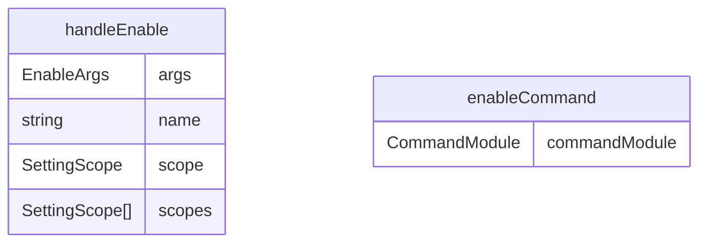

# enable.ts

扩展启用命令，用于启用已安装的 Gemini CLI 扩展。

## 功能概述

1. 启用指定名称的扩展
2. 支持用户和工作区作用域
3. 提供启用成功反馈

## 主要函数

### handleEnable(args: EnableArgs)
处理扩展启用：
- 调用扩展启用函数
- 提供启用成功反馈
- 处理错误情况

参数：
- args.name: 要启用的扩展名称
- args.scope: 启用作用域（用户或工作区，可选）

### enableCommand: CommandModule
Yargs 命令模块，定义 enable 子命令：
- command: 'enable [--scope] <name>'
- describe: 'Enables an extension.'
- builder: 参数构建器
  - name: 扩展名称（位置参数）
  - scope: 作用域（选项参数，可选）
- handler: 命令处理器，调用 handleEnable 函数

## 使用示例

```bash
# 启用扩展（所有作用域）
gemini extensions enable my-extension

# 在用户作用域启用扩展
gemini extensions enable my-extension --scope user

# 在工作区作用域启用扩展
gemini extensions enable my-extension --scope workspace
```

## 函数级调用关系



## 变量级调用关系

