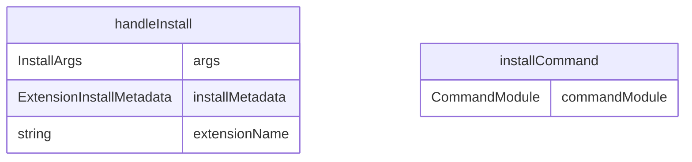

# install.ts

扩展安装命令，用于安装新的 Gemini CLI 扩展。

## 功能概述

1. 从 Git 仓库安装扩展
2. 从本地路径安装扩展
3. 支持 GitHub 简短格式（org/repo）
4. 自动启用安装的扩展

## 主要函数

### handleInstall(args: InstallArgs)
处理扩展安装：
- 验证源参数（Git URL 或本地路径）
- 解析 GitHub 简短格式
- 调用扩展安装函数
- 提供安装成功反馈

参数：
- args.source: Git URL 或 "org/repo" 格式
- args.path: 本地扩展路径

### installCommand: CommandModule
Yargs 命令模块，定义 install 子命令：
- command: 'install [source]'
- describe: 'Installs an extension from a git repository or a local path'
- builder: 参数构建器
  - source: Git URL 或 "org/repo"（位置参数）
  - path: 本地路径（选项参数）
- handler: 命令处理器，调用 handleInstall 函数

## 支持的安装源

### Git 仓库
- 完整的 Git URL：`https://github.com/user/repo.git`
- GitHub 简短格式：`user/repo`
- SSH 格式：`git@github.com:user/repo.git`

### 本地路径
- 绝对路径：`/path/to/extension`
- 相对路径：`./my-extension`

## 安装流程

1. 验证安装源
2. 创建用户扩展目录（如果不存在）
3. 克隆 Git 仓库或复制本地文件
4. 验证扩展配置文件
5. 将扩展复制到用户扩展目录
6. 保存安装元数据
7. 启用扩展

## 使用示例

```bash
# 从 GitHub 安装扩展
gemini extensions install user/repo

# 从完整 Git URL 安装扩展
gemini extensions install https://github.com/user/repo.git

# 从本地路径安装扩展
gemini extensions install --path ./my-extension

# 从 SSH URL 安装扩展
gemini extensions install git@github.com:user/repo.git
```

## 错误处理

- 验证扩展配置文件（gemini-extension.json）
- 处理 Git 克隆错误
- 检查扩展是否已安装
- 提供详细的错误信息

## 函数级调用关系


## 变量级调用关系

