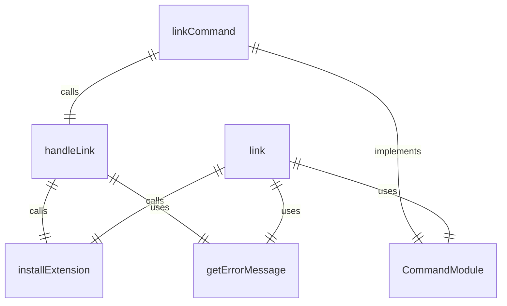
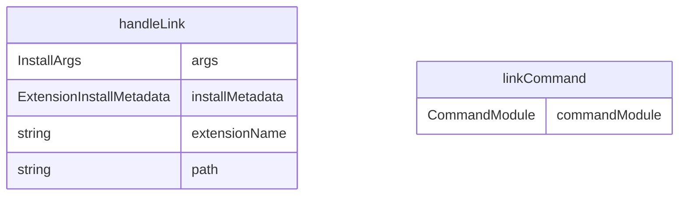

# link.ts

扩展链接命令，用于链接本地路径的 Gemini CLI 扩展。

## 功能概述

1. 从本地路径链接扩展
2. 创建到本地扩展目录的链接
3. 便于开发和测试

## 主要函数

### handleLink(args: InstallArgs)
处理扩展链接：
- 创建扩展安装元数据
- 调用扩展安装函数
- 提供链接成功反馈
- 处理错误情况

参数：
- args.path: 本地扩展路径

### linkCommand: CommandModule
Yargs 命令模块，定义 link 子命令：
- command: 'link <path>'
- describe: 'Links an extension from a local path. Updates made to the local path will always be reflected.'
- builder: 参数构建器
  - path: 本地扩展路径（位置参数）
- handler: 命令处理器，调用 handleLink 函数

## 使用示例

```bash
# 链接本地扩展
gemini extensions link /path/to/my-extension
```

## 函数级调用关系



## 变量级调用关系

