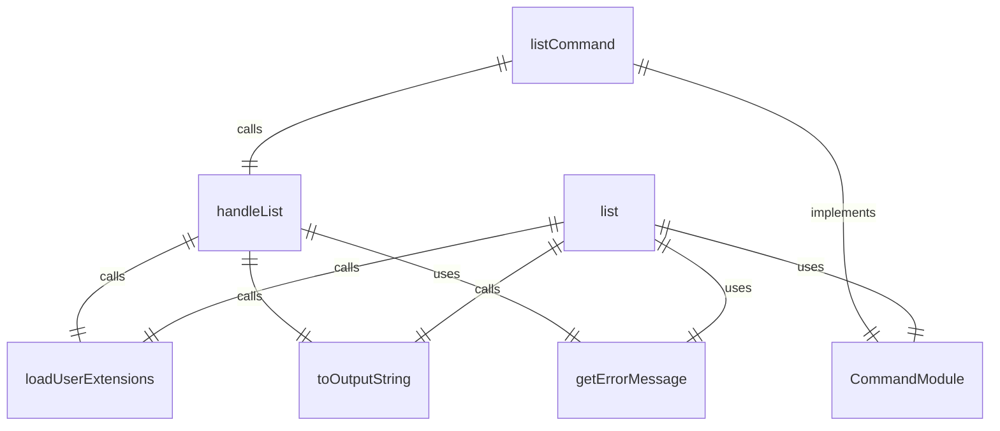
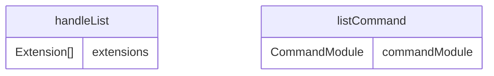

# list.ts

扩展列表命令，用于显示已安装的 Gemini CLI 扩展。

## 功能概述

1. 列出所有已安装的扩展
2. 显示扩展详细信息
3. 格式化输出扩展信息

## 主要函数

### handleList()
处理扩展列表显示：
- 加载用户扩展
- 处理空扩展列表情况
- 格式化并显示扩展信息
- 处理错误情况

### listCommand: CommandModule
Yargs 命令模块，定义 list 子命令：
- command: 'list'
- describe: 'Lists installed extensions'
- builder: 参数构建器（无特殊参数）
- handler: 命令处理器，调用 handleList 函数

## 扩展信息显示

### toOutputString(extension: Extension): string
将扩展信息格式化为字符串：
- 扩展名称和版本
- 扩展路径
- 安装源信息（如果可用）
- 上下文文件列表
- MCP 服务器列表
- 排除工具列表

## 使用示例

```bash
# 列出所有已安装的扩展
gemini extensions list
```

输出示例：
```
my-extension (1.0.0)
 Path: /home/user/.gemini/extensions/my-extension
 Source: https://github.com/user/my-extension.git (Type: git)
 Context files:
  /home/user/.gemini/extensions/my-extension/GEMINI.md
 MCP servers:
  my-server
 Excluded tools:
  dangerous-tool
```

## 错误处理

- 处理扩展加载错误
- 显示友好的错误信息
- 在出错时以非零退出码退出

## 函数级调用关系



## 变量级调用关系

