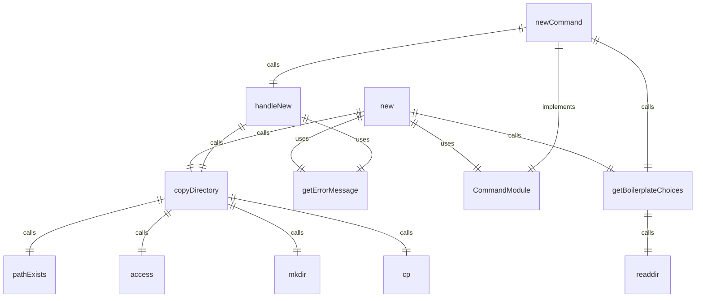
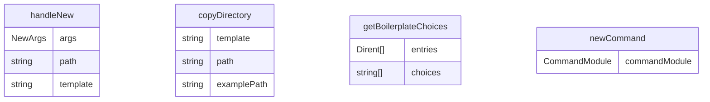

# new.ts

扩展创建命令，用于从模板创建新的 Gemini CLI 扩展。

## 功能概述

1. 从模板创建新的扩展
2. 支持多种模板选择
3. 提供创建成功反馈

## 主要函数

### handleNew(args: NewArgs)
处理新扩展创建：
- 调用目录复制函数
- 提供创建成功反馈
- 处理错误情况

参数：
- args.path: 创建扩展的路径
- args.template: 使用的模板名称

### newCommand: CommandModule
Yargs 命令模块，定义 new 子命令：
- command: 'new <path> <template>'
- describe: 'Create a new extension from a boilerplate example.'
- builder: 参数构建器
  - path: 创建扩展的路径（位置参数）
  - template: 使用的模板（位置参数）
- handler: 命令处理器，调用 handleNew 函数

## 辅助函数

### pathExists(path: string): Promise<boolean>
检查路径是否存在

### copyDirectory(template: string, path: string): Promise<void>
复制模板目录到指定路径

### getBoilerplateChoices(): Promise<string[]>
获取可用的模板选择

## 使用示例

```bash
# 从模板创建新扩展
gemini extensions new ./my-extension context

# 从MCP服务器模板创建新扩展
gemini extensions new ./my-mcp-extension mcp-server
```

## 函数级调用关系



## 变量级调用关系

