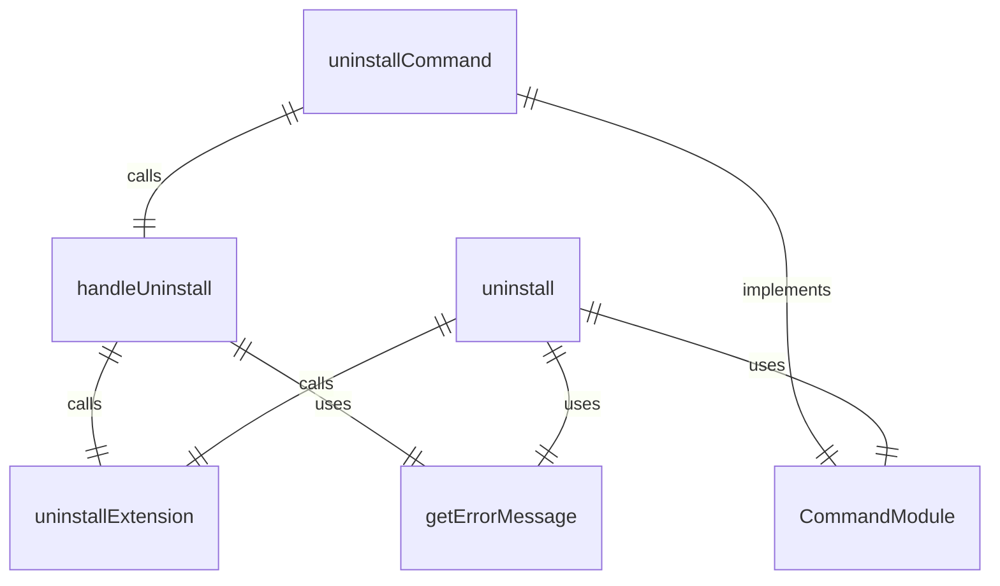
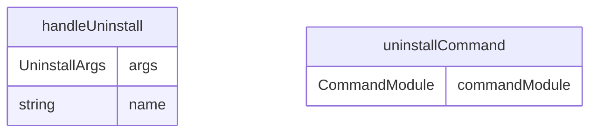

# uninstall.ts

扩展卸载命令，用于卸载已安装的 Gemini CLI 扩展。

## 功能概述

1. 卸载指定名称的扩展
2. 从禁用列表中移除扩展
3. 提供卸载成功反馈

## 主要函数

### handleUninstall(args: UninstallArgs)
处理扩展卸载：
- 调用扩展卸载函数
- 提供卸载成功反馈
- 处理错误情况

参数：
- args.name: 要卸载的扩展名称

### uninstallCommand: CommandModule
Yargs 命令模块，定义 uninstall 子命令：
- command: 'uninstall <name>'
- describe: 'Uninstalls an extension.'
- builder: 参数构建器
  - name: 扩展名称（位置参数）
- handler: 命令处理器，调用 handleUninstall 函数

## 使用示例

```bash
# 卸载扩展
gemini extensions uninstall my-extension
```

## 函数级调用关系



## 变量级调用关系

