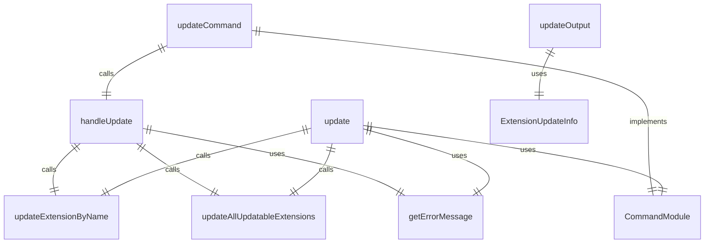
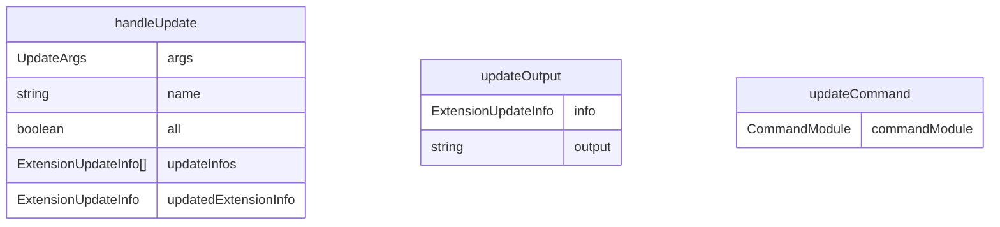

# update.ts

扩展更新命令，用于更新已安装的 Gemini CLI 扩展。

## 功能概述

1. 更新指定名称的扩展
2. 更新所有可更新的扩展
3. 提供版本更新信息

## 主要函数

### handleUpdate(args: UpdateArgs)
处理扩展更新：
- 更新单个扩展或所有扩展
- 提供更新成功反馈
- 处理错误情况

参数：
- args.name: 要更新的扩展名称（可选）
- args.all: 是否更新所有扩展（可选）

### updateCommand: CommandModule
Yargs 命令模块，定义 update 子命令：
- command: 'update [--all] [name]'
- describe: 'Updates all extensions or a named extension to the latest version.'
- builder: 参数构建器
  - name: 扩展名称（位置参数，可选）
  - all: 更新所有扩展（选项参数）
- handler: 命令处理器，调用 handleUpdate 函数

## 辅助函数

### updateOutput(info: ExtensionUpdateInfo): string
格式化更新信息输出

## 使用示例

```bash
# 更新单个扩展
gemini extensions update my-extension

# 更新所有可更新的扩展
gemini extensions update --all
```

## 函数级调用关系



## 变量级调用关系

