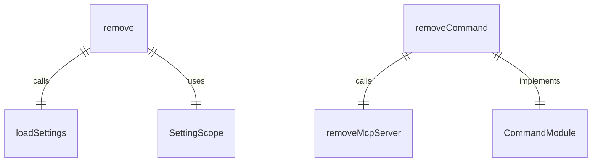
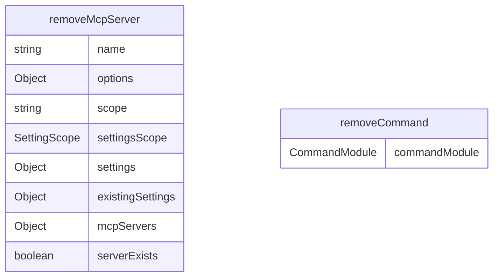

# remove.ts

MCP 服务器移除命令，用于从配置中删除 MCP 服务器。

## 功能概述

1. 从配置中移除指定的 MCP 服务器
2. 支持用户和工作区作用域
3. 提供确认反馈

## 主要函数

### removeMcpServer(name: string, options: { scope: string })
移除 MCP 服务器：
- 根据作用域加载相应设置
- 检查服务器是否存在
- 从配置中删除服务器
- 保存更新后的配置
- 提供操作反馈

参数：
- name: 要移除的服务器名称
- options.scope: 配置作用域（'user' 或 'project'）

### removeCommand: CommandModule
Yargs 命令模块，定义 remove 子命令：
- command: 'remove <name>'
- describe: 'Remove a server'
- builder: 参数构建器
  - name: 服务器名称（必需）
  - scope: 配置作用域（默认为 'project'）
- handler: 命令处理器，调用 removeMcpServer 函数

## 使用示例

```bash
# 从项目设置中移除服务器
gemini mcp remove my-server

# 从用户设置中移除服务器
gemini mcp remove my-server --scope user
```

## 错误处理

- 如果指定的服务器不存在，会显示相应提示信息
- 操作成功后会显示确认信息

## 函数级调用关系



## 变量级调用关系

