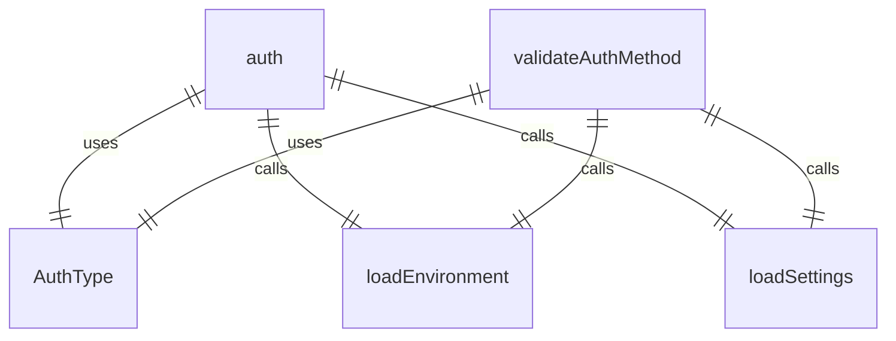
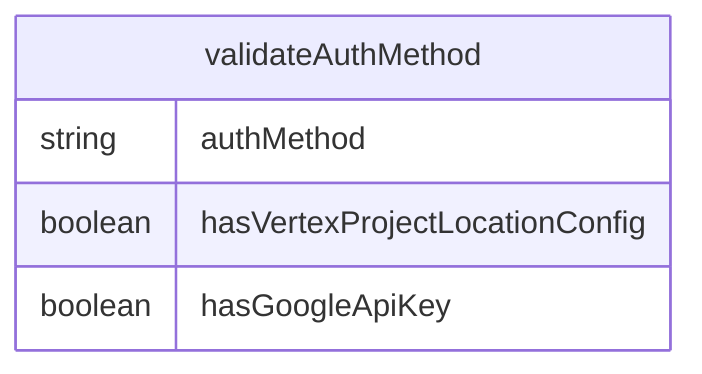

# auth.ts

## 概述

`auth.ts` 是 cli 包中处理身份验证方法验证的模块。该文件导出一个 `validateAuthMethod` 函数，用于验证用户选择的身份验证方法是否配置正确。

## 导出的函数

### validateAuthMethod
验证指定的身份验证方法是否配置正确：

1. **参数**:
   - `authMethod`: 字符串类型，表示用户选择的身份验证方法

2. **功能**:
   - 加载环境设置和配置
   - 验证不同的身份验证方法：
     - `LOGIN_WITH_GOOGLE` 和 `CLOUD_SHELL`: 直接返回 null（有效）
     - `USE_GEMINI`: 检查 `GEMINI_API_KEY` 环境变量是否存在
     - `USE_VERTEX_AI`: 检查 `GOOGLE_CLOUD_PROJECT` 和 `GOOGLE_CLOUD_LOCATION` 或 `GOOGLE_API_KEY` 环境变量是否存在
   - 返回 null 表示验证通过，返回字符串表示错误信息

3. **返回值**:
   - 验证通过时返回 `null`
   - 验证失败时返回错误信息字符串

## 依赖模块

- `@google/gemini-cli-core`: 提供 `AuthType` 枚举
- `./settings.js`: 提供 `loadEnvironment` 和 `loadSettings` 函数

## 使用场景

该模块主要用于：
1. 在用户选择身份验证方法时进行验证
2. 确保必要的环境变量已正确设置
3. 提供清晰的错误信息指导用户正确配置身份验证

## 设计考虑

该模块的设计考虑了多种身份验证方法：
1. Google 登录和 Cloud Shell 方式无需额外配置
2. Gemini API 方式需要 API 密钥
3. Vertex AI 方式需要项目配置或 API 密钥
4. 提供详细的错误信息帮助用户解决问题

## 函数级调用关系

## 变量级调用关系

