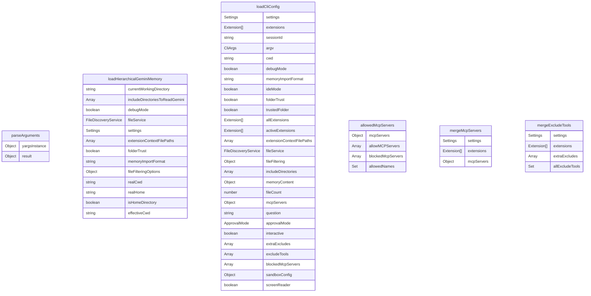

# config.ts

配置管理模块，负责处理 CLI 的配置和命令行参数解析。

## 功能概述

1. 命令行参数解析
2. 配置加载和合并
3. 内存管理配置
4. MCP 服务器配置
5. 工具排除和包含设置

## 主要接口

### CliArgs
定义所有支持的命令行参数：
- model: 指定使用的模型
- sandbox: 沙箱模式开关
- debug: 调试模式开关
- prompt: 提示文本
- allFiles: 包含所有文件
- approvalMode: 审批模式设置
- telemetry: 遥测功能开关
- extensions: 扩展列表
- listExtensions: 列出所有扩展
- screenReader: 屏幕阅读器模式

## 主要函数

### parseArguments(settings: Settings): Promise<CliArgs>
解析命令行参数并返回配置对象：
- 使用 yargs 库处理命令行参数
- 定义命令和选项
- 注册 MCP 和扩展子命令
- 处理参数验证和冲突检查
- 支持版本和帮助信息显示

### loadHierarchicalGeminiMemory()
加载分层的 Gemini 内存内容：
- 处理当前工作目录
- 支持包含目录
- 调试模式支持
- 文件服务集成
- 扩展上下文文件处理
- 文件过滤选项

### loadCliConfig(settings, extensions, sessionId, argv, cwd)
加载 CLI 配置：
- 合并设置、扩展和命令行参数
- 处理认证和安全设置
- 配置 MCP 服务器
- 设置工具排除列表
- 配置遥测和代理设置
- 初始化 Config 对象

## 辅助函数

### allowedMcpServers()
过滤允许的 MCP 服务器。

### mergeMcpServers()
合并 MCP 服务器配置。

### mergeExcludeTools()
合并排除工具列表。

## 常量

- 支持的命令行选项和别名
- 参数验证规则
- 默认值设置
- 弃用选项警告

## 函数级调用关系

```mermaid
erDiagram
    config ||--|| yargs : uses
    config ||--|| mcpCommand : imports
    config ||--|| extensionsCommand : imports
    config ||--|| Config : creates
    config ||--|| loadServerHierarchicalMemory : calls
    config ||--|| setServerGeminiMdFilename : calls
    config ||--|| getCurrentGeminiMdFilename : calls
    config ||--|| ApprovalMode : uses
    config ||--|| DEFAULT_GEMINI_MODEL : uses
    config ||--|| DEFAULT_GEMINI_EMBEDDING_MODEL : uses
    config ||--|| DEFAULT_MEMORY_FILE_FILTERING_OPTIONS : uses
    config ||--|| ShellTool : uses
    config ||--|| EditTool : uses
    config ||--|| WriteFileTool : uses
    config ||--|| annotateActiveExtensions : calls
    config ||--|| getCliVersion : calls
    config ||--|| loadSandboxConfig : calls
    config ||--|| resolvePath : calls
    config ||--|| appEvents : uses
    config ||--|| isWorkspaceTrusted : calls
    parseArguments ||--|| yargs : uses
    parseArguments ||--|| mcpCommand : imports
    parseArguments ||--|| extensionsCommand : imports
    parseArguments ||--|| getCliVersion : calls
    loadHierarchicalGeminiMemory ||--|| loadServerHierarchicalMemory : calls
    loadCliConfig ||--|| annotateActiveExtensions : calls
    loadCliConfig ||--|| setServerGeminiMdFilename : calls
    loadCliConfig ||--|| getCurrentGeminiMdFilename : calls
    loadCliConfig ||--|| FileDiscoveryService : creates
    loadCliConfig ||--|| loadHierarchicalGeminiMemory : calls
    loadCliConfig ||--|| mergeMcpServers : calls
    loadCliConfig ||--|| allowedMcpServers : calls
    loadCliConfig ||--|| mergeExcludeTools : calls
    loadCliConfig ||--|| loadSandboxConfig : calls
    loadCliConfig ||--|| Config : creates
    allowedMcpServers ||--|| MCPServerConfig : uses
    mergeMcpServers ||--|| Settings : uses
    mergeMcpServers ||--|| Extension : uses
    mergeExcludeTools ||--|| Settings : uses
    mergeExcludeTools ||--|| Extension : uses
```

## 变量级调用关系

