# extension.ts

扩展管理模块，负责处理 Gemini CLI 扩展的安装、加载和管理。

## 功能概述

1. 扩展加载和解析
2. 扩展安装和卸载
3. 扩展更新和迁移
4. 扩展启用和禁用

## 主要接口

### Extension
表示一个已加载的扩展：
- path: 扩展路径
- config: 扩展配置
- contextFiles: 上下文文件列表
- installMetadata: 安装元数据（可选）

### ExtensionConfig
扩展配置接口：
- name: 扩展名称
- version: 扩展版本
- mcpServers: MCP 服务器配置（可选）
- contextFileName: 上下文文件名（可选）
- excludeTools: 排除工具列表（可选）

### ExtensionInstallMetadata
扩展安装元数据：
- source: 安装源
- type: 安装类型（'git' | 'local' | 'link'）

## 主要类

### ExtensionStorage
扩展存储管理类：
- getExtensionDir(): 获取扩展目录
- getConfigPath(): 获取配置文件路径
- static getUserExtensionsDir(): 获取用户扩展目录
- static createTmpDir(): 创建临时目录

## 主要函数

### loadExtensions(workspaceDir: string = process.cwd()): Extension[]
加载所有扩展：
1. 加载用户扩展
2. 根据工作区信任状态加载工作区扩展
3. 合并扩展并去重
4. 过滤禁用的扩展

### loadUserExtensions(): Extension[]
加载用户扩展：
1. 从用户目录加载扩展
2. 去重处理
3. 返回唯一扩展列表

### loadExtensionsFromDir(dir: string): Extension[]
从指定目录加载扩展：
1. 获取扩展目录
2. 遍历子目录
3. 加载每个扩展
4. 返回扩展列表

### loadExtension(extensionDir: string): Extension | null
加载单个扩展：
1. 验证目录有效性
2. 加载安装元数据
3. 解析配置文件
4. 处理上下文文件
5. 返回扩展对象

### installExtension(installMetadata: ExtensionInstallMetadata, cwd: string = process.cwd()): Promise<string>
安装扩展：
1. 验证工作区信任状态
2. 创建用户扩展目录
3. 根据安装类型处理源
4. 克隆 Git 仓库或复制本地文件
5. 验证扩展配置
6. 复制文件到目标位置
7. 保存安装元数据
8. 返回扩展名称

### uninstallExtension(extensionName: string, cwd: string = process.cwd()): Promise<void>
卸载扩展：
1. 验证扩展是否存在
2. 从禁用列表中移除
3. 删除扩展目录

### updateExtension(extension: Extension, cwd: string = process.cwd()): Promise<ExtensionUpdateInfo>
更新扩展：
1. 验证扩展是否可更新
2. 创建备份
3. 卸载当前版本
4. 重新安装新版本
5. 处理更新失败回滚

### disableExtension(name: string, scope: SettingScope, cwd: string = process.cwd())
禁用扩展：
1. 将扩展添加到禁用列表
2. 保存设置

### enableExtension(name: string, scopes: SettingScope[])
启用扩展：
1. 从禁用列表中移除扩展
2. 保存设置

## 辅助函数

### annotateActiveExtensions(extensions, enabledExtensionNames, workspaceDir): GeminiCLIExtension[]
标注活动扩展：
- 根据启用列表标记扩展状态
- 处理 "none" 特殊值
- 返回带状态的扩展列表

### toOutputString(extension: Extension): string
将扩展信息格式化为字符串：
- 包含名称、版本、路径
- 显示安装源信息
- 列出上下文文件
- 显示 MCP 服务器和排除工具

### performWorkspaceExtensionMigration(extensions: Extension[]): Promise<string[]>
执行工作区扩展迁移：
- 将工作区扩展迁移到用户扩展
- 返回迁移失败的扩展名称列表

## 常量

### EXTENSIONS_DIRECTORY_NAME
扩展目录名称：`.gemini/extensions`

### EXTENSIONS_CONFIG_FILENAME
扩展配置文件名：`gemini-extension.json`

### INSTALL_METADATA_FILENAME
安装元数据文件名：`.gemini-extension-install.json`

## 使用场景

- CLI 启动时加载扩展
- 扩展管理命令执行
- 工作区扩展迁移
- 扩展配置解析

## 函数级调用关系

```mermaid
erDiagram
    extension ||--|| Storage : uses
    extension ||--|| fs : uses
    extension ||--|| path : uses
    extension ||--|| os : uses
    extension ||--|| simpleGit : uses
    extension ||--|| SettingScope : uses
    extension ||--|| loadSettings : calls
    extension ||--|| getErrorMessage : uses
    extension ||--|| recursivelyHydrateStrings : calls
    extension ||--|| isWorkspaceTrusted : calls
    extension ||--|| resolveEnvVarsInObject : calls
    ExtensionStorage ||--|| Storage : uses
    ExtensionStorage ||--|| fs : uses
    ExtensionStorage ||--|| path : uses
    ExtensionStorage ||--|| os : uses
    getWorkspaceExtensions ||--|| loadExtensionsFromDir : calls
    copyExtension ||--|| fs : uses
    performWorkspaceExtensionMigration ||--|| installExtension : calls
    loadExtensions ||--|| loadUserExtensions : calls
    loadExtensions ||--|| getWorkspaceExtensions : calls
    loadExtensions ||--|| isWorkspaceTrusted : calls
    loadExtensions ||--|| loadSettings : calls
    loadUserExtensions ||--|| loadExtensionsFromDir : calls
    loadExtensionsFromDir ||--|| Storage : uses
    loadExtensionsFromDir ||--|| fs : uses
    loadExtensionsFromDir ||--|| path : uses
    loadExtensionsFromDir ||--|| loadExtension : calls
    loadExtension ||--|| fs : uses
    loadExtension ||--|| path : uses
    loadExtension ||--|| loadInstallMetadata : calls
    loadExtension ||--|| getContextFileNames : calls
    loadExtension ||--|| recursivelyHydrateStrings : calls
    loadExtension ||--|| resolveEnvVarsInObject : calls
    loadInstallMetadata ||--|| fs : uses
    loadInstallMetadata ||--|| path : uses
    getContextFileNames ||--|| ExtensionConfig : uses
    annotateActiveExtensions ||--|| loadSettings : calls
    cloneFromGit ||--|| simpleGit : uses
    installExtension ||--|| ExtensionStorage : creates
    installExtension ||--|| loadSettings : calls
    installExtension ||--|| isWorkspaceTrusted : calls
    installExtension ||--|| fs : uses
    installExtension ||--|| path : uses
    installExtension ||--|| cloneFromGit : calls
    installExtension ||--|| loadExtensionConfig : calls
    installExtension ||--|| copyExtension : calls
    loadExtensionConfig ||--|| fs : uses
    loadExtensionConfig ||--|| path : uses
    loadExtensionConfig ||--|| recursivelyHydrateStrings : calls
    uninstallExtension ||--|| loadUserExtensions : calls
    uninstallExtension ||--|| removeFromDisabledExtensions : calls
    uninstallExtension ||--|| ExtensionStorage : creates
    uninstallExtension ||--|| fs : uses
    toOutputString ||--|| Extension : uses
    updateExtensionByName ||--|| loadUserExtensions : calls
    updateExtensionByName ||--|| updateExtension : calls
    updateExtension ||--|| ExtensionStorage : creates
    updateExtension ||--|| loadExtension : calls
    updateExtension ||--|| uninstallExtension : calls
    updateExtension ||--|| installExtension : calls
    updateExtension ||--|| fs : uses
    updateExtension ||--|| copyExtension : calls
    disableExtension ||--|| SettingScope : uses
    disableExtension ||--|| loadSettings : calls
    enableExtension ||--|| removeFromDisabledExtensions : calls
    removeFromDisabledExtensions ||--|| loadSettings : calls
    updateAllUpdatableExtensions ||--|| loadExtensions : calls
    updateAllUpdatableExtensions ||--|| updateExtension : calls
```

## 变量级调用关系

```mermaid
erDiagram
    ExtensionStorage {
        string extensionName
    }
    getWorkspaceExtensions {
        string workspaceDir
        Extension[] extensions
    }
    copyExtension {
        string source
        string destination
    }
    performWorkspaceExtensionMigration {
        Extension[] extensions
        string[] failedInstallNames
    }
    loadExtensions {
        string workspaceDir
        Object settings
        Array disabledExtensions
        Extension[] allExtensions
        Map uniqueExtensions
    }
    loadUserExtensions {
        Extension[] userExtensions
        Map uniqueExtensions
    }
    loadExtensionsFromDir {
        string dir
        Storage storage
        string extensionsDir
        Extension[] extensions
        string[] subdirs
        string subdir
        string extensionDir
        Extension extension
    }
    loadExtension {
        string extensionDir
        ExtensionInstallMetadata installMetadata
        string effectiveExtensionPath
        string configFilePath
        string configContent
        ExtensionConfig config
        string[] contextFiles
    }
    loadInstallMetadata {
        string extensionDir
        string metadataFilePath
        string configContent
        ExtensionInstallMetadata metadata
    }
    getContextFileNames {
        ExtensionConfig config
        string[] contextFileNames
    }
    annotateActiveExtensions {
        Extension[] extensions
        string[] enabledExtensionNames
        string workspaceDir
        Object settings
        Array disabledExtensions
        GeminiCLIExtension[] annotatedExtensions
        Set lowerCaseEnabledExtensions
        Set notFoundNames
    }
    cloneFromGit {
        string gitUrl
        string destination
    }
    installExtension {
        ExtensionInstallMetadata installMetadata
        string cwd
        Object settings
        string extensionsDir
        string localSourcePath
        string tempDir
        string newExtensionName
        ExtensionConfig newExtensionConfig
        ExtensionStorage extensionStorage
        string destinationPath
        Extension[] installedExtensions
        string metadataString
        string metadataPath
    }
    loadExtensionConfig {
        string extensionDir
        string configFilePath
        string configContent
        ExtensionConfig config
    }
    uninstallExtension {
        string extensionName
        string cwd
        Extension[] installedExtensions
        ExtensionStorage storage
    }
    toOutputString {
        Extension extension
        string output
    }
    updateExtensionByName {
        string extensionName
        string cwd
        Extension[] installedExtensions
        Extension extension
        ExtensionUpdateInfo updateInfo
    }
    updateExtension {
        Extension extension
        string cwd
        string originalVersion
        string tempDir
        ExtensionStorage updatedExtensionStorage
        Extension updatedExtension
        string updatedVersion
    }
    disableExtension {
        string name
        SettingScope scope
        string cwd
        Object settings
        Object settingsFile
        Object extensionSettings
        Array disabledExtensions
    }
    enableExtension {
        string name
        SettingScope[] scopes
    }
    removeFromDisabledExtensions {
        string name
        SettingScope[] scopes
        string cwd
        Object settings
        Object settingsFile
        Object extensionSettings
        Array disabledExtensions
    }
    updateAllUpdatableExtensions {
        string cwd
        Extension[] extensions
        ExtensionUpdateInfo[] updateInfos
    }
```

