# settings.ts

设置管理模块，负责处理用户、工作区和系统级别的配置设置。

## 功能概述

1. 设置文件加载和保存
2. 多级设置合并（系统默认、用户、工作区、系统）
3. 设置迁移（V1 到 V2）
4. 环境变量处理
5. 工作区信任检查

## 主要接口和类型

### Settings
定义所有可用的设置选项，包括：
- 安全设置（认证、文件夹信任）
- UI 设置（主题、可访问性）
- 工具设置（核心工具、排除工具）
- 模型设置
- 遥测设置
- 上下文设置

### LoadedSettings
封装加载的设置信息：
- 系统、系统默认、用户和工作区设置
- 合并后的设置
- 迁移状态信息

### SettingScope
枚举类型，定义设置作用域：
- User: 用户级别
- Workspace: 工作区级别
- System: 系统级别
- SystemDefaults: 系统默认级别

## 主要函数

### loadSettings(workspaceDir: string = process.cwd()): LoadedSettings
加载所有级别的设置：
1. 加载系统设置
2. 加载系统默认设置
3. 加载用户设置
4. 加载工作区设置（如果不是主目录）
5. 处理主题名称兼容性
6. 检查工作区信任状态
7. 加载环境变量
8. 解析环境变量
9. 返回合并后的设置

### saveSettings(settingsFile: SettingsFile): void
保存设置到文件：
- 确保目录存在
- 处理设置迁移
- 写入 JSON 格式的设置文件

### needsMigration(settings: Record<string, unknown>): boolean
检查设置是否需要从 V1 迁移到 V2 格式。

### migrateSettingsToV2(flatSettings: Record<string, unknown>): Record<string, unknown> | null
将 V1 格式的设置迁移到 V2 格式。

### migrateSettingsToV1(v2Settings: Record<string, unknown>): Record<string, unknown>
将 V2 格式的设置迁移到 V1 格式。

## 辅助函数

### mergeSettings()
合并多个设置对象，按照优先级顺序：
1. 系统默认设置
2. 用户设置
3. 工作区设置（仅在受信任时）
4. 系统设置（作为覆盖）

### loadEnvironment(settings: Settings): void
加载环境变量：
- 查找 .env 文件
- 处理工作区信任
- 特殊处理 Cloud Shell 环境
- 解析和设置环境变量

### findEnvFile(startDir: string): string | null
在目录树中查找 .env 文件。

### setUpCloudShellEnvironment(envFilePath: string | null): void
设置 Cloud Shell 环境变量。

## 常量

### MIGRATION_MAP
定义 V1 到 V2 设置路径的映射关系。

### KNOWN_V2_CONTAINERS
已知的 V2 设置容器键。

### DEFAULT_EXCLUDED_ENV_VARS
默认排除的环境变量列表。

## 文件路径

- USER_SETTINGS_PATH: 用户设置文件路径
- SETTINGS_DIRECTORY_NAME: 设置目录名称

## 函数级调用关系

## 变量级调用关系

```mermaid
erDiagram
    getMergeStrategyForPath {
        string[] path
        SettingDefinition current
        SettingsSchema currentSchema
    }
    setNestedProperty {
        Record obj
        string path
        unknown value
        string[] keys
        string lastKey
        Record current
    }
    needsMigration {
        Record settings
        boolean hasV1Keys
        Set flatKeys
    }
    migrateSettingsToV2 {
        Record flatSettings
        Record v2Settings
        Set flatKeys
    }
    getNestedProperty {
        Record obj
        string path
        unknown current
        string[] keys
    }
    migrateSettingsToV1 {
        Record v2Settings
        Record v1Settings
        Set v2Keys
    }
    mergeSettings {
        Settings system
        Settings systemDefaults
        Settings user
        Settings workspace
        boolean isTrusted
        Settings merged
    }
    LoadedSettings {
        SettingsFile system
        SettingsFile systemDefaults
        SettingsFile user
        SettingsFile workspace
        boolean isTrusted
        Set migratedInMemorScopes
        Settings _merged
    }
    findEnvFile {
        string startDir
        string currentDir
        string geminiEnvPath
        string envPath
        string parentDir
        string homeGeminiEnvPath
        string homeEnvPath
    }
    setUpCloudShellEnvironment {
        string envFilePath
        string envFileContent
        Object parsedEnv
    }
    loadEnvironment {
        Settings settings
        string envFilePath
        string envFileContent
        Object parsedEnv
        Array excludedVars
        boolean isProjectEnvFile
    }
    loadSettings {
        string workspaceDir
        Settings systemSettings
        Settings systemDefaultSettings
        Settings userSettings
        Settings workspaceSettings
        SettingsError[] settingsErrors
        string systemSettingsPath
        string systemDefaultsPath
        Set migratedInMemorScopes
        string resolvedWorkspaceDir
        string resolvedHomeDir
        string realWorkspaceDir
        string realHomeDir
        string workspaceSettingsPath
        boolean isTrusted
        Settings tempMergedSettings
    }
    saveSettings {
        SettingsFile settingsFile
        string dirPath
        Settings settingsToSave
    }
    loadAndMigrate {
        string filePath
        SettingScope scope
        string content
        unknown rawSettings
        Record settingsObject
    }
```

