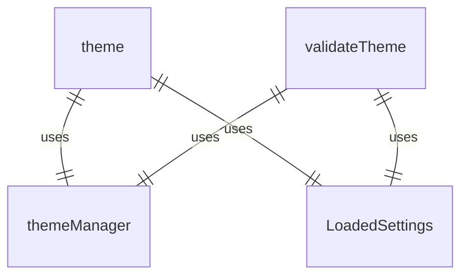
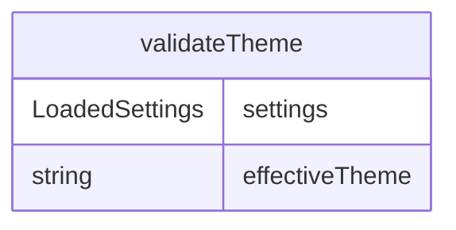

# theme.ts

主题验证模块，负责验证应用程序的主题配置。

## 功能概述

1. 验证主题配置
2. 检查主题是否存在
3. 返回验证结果

## 主要函数

### validateTheme(settings: LoadedSettings): string | null
验证配置的主题：

1. **参数**:
   - `settings`: LoadedSettings 类型，包含加载的应用程序设置

2. **功能**:
   - 获取有效的主题设置
   - 检查主题是否存在
   - 返回错误信息或 null（成功时）

3. **返回值**:
   - string | null: 错误信息字符串或 null（成功时）

## 验证流程

1. **获取主题设置**
   - 从 settings.merged.ui?.theme 获取配置的主题名称

2. **主题存在性检查**
   - 使用 themeManager.findThemeByName 检查主题是否存在

3. **结果返回**
   - 如果主题不存在，返回错误信息
   - 如果主题存在或未配置主题，返回 null

## 依赖关系

- 依赖 ../ui/themes/theme-manager.js 的 themeManager
- 依赖 ../config/settings.js 的 LoadedSettings 类型

## 使用场景

此函数在应用程序初始化期间调用，作为 initializeApp 函数的一部分，确保配置的主题有效后再显示用户界面。

## 函数级调用关系

## 变量级调用关系

