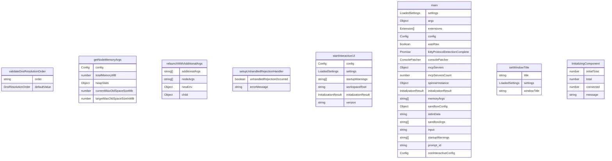

# gemini.tsx

这是 Gemini CLI 的主要入口文件，包含了应用程序的核心逻辑和 UI 初始化。

## 功能概述

1. 应用程序初始化和配置加载
2. 内存管理和文件发现服务
3. UI 渲染和交互处理
4. 命令行参数解析
5. 扩展和 MCP 服务器管理
6. 认证和安全处理

## 主要函数

### validateDnsResolutionOrder(order: string | undefined): DnsResolutionOrder
验证 DNS 解析顺序设置，确保其为有效的值（'ipv4first' 或 'verbatim'）。

### getNodeMemoryArgs(config: Config): string[]
根据系统内存情况计算 Node.js 的内存参数，用于优化性能。

### relaunchWithAdditionalArgs(additionalArgs: string[])
使用额外的参数重新启动应用程序，主要用于内存优化。

### setupUnhandledRejectionHandler()
设置未处理的 Promise 拒绝处理器，捕获并记录未处理的异常。

### startInteractiveUI(config, settings, startupWarnings, workspaceRoot, initializationResult)
启动交互式 UI 界面：
- 设置窗口标题
- 创建 React 组件包装器
- 渲染应用程序
- 检查更新

### main()
应用程序的主入口函数，执行以下操作：
1. 设置未处理拒绝处理器
2. 加载设置和配置
3. 解析命令行参数
4. 初始化扩展
5. 处理原始模式输入
6. 补丁控制台输出
7. 设置 DNS 解析顺序
8. 处理扩展列表请求
9. 设置最大盒子调试
10. 初始化 MCP 服务器连接
11. 加载自定义主题
12. 初始化应用程序
13. 处理沙箱环境
14. 启动交互式 UI 或非交互式模式

## 组件

### InitializingComponent
显示 MCP 服务器连接进度的加载组件。

## 常量和配置

- 使用 React 和 Ink 构建 TUI（终端用户界面）
- 支持 MCP（Model Context Protocol）服务器连接
- 集成扩展系统
- 支持主题定制
- 包含更新检查机制

## 函数级调用关系

```mermaid
erDiagram
    gemini ||--|| React : uses
    gemini ||--|| render : uses
    gemini ||--|| Box : uses
    gemini ||--|| Text : uses
    gemini ||--|| Spinner : uses
    gemini ||--|| AppContainer : uses
    gemini ||--|| loadCliConfig : calls
    gemini ||--|| parseArguments : calls
    gemini ||--|| readStdin : calls
    gemini ||--|| basename : uses
    gemini ||--|| v8 : uses
    gemini ||--|| os : uses
    gemini ||--|| dns : uses
    gemini ||--|| spawn : uses
    gemini ||--|| start_sandbox : calls
    gemini ||--|| loadSettings : calls
    gemini ||--|| themeManager : uses
    gemini ||--|| getStartupWarnings : calls
    gemini ||--|| getUserStartupWarnings : calls
    gemini ||--|| ConsolePatcher : creates
    gemini ||--|| runNonInteractive : calls
    gemini ||--|| loadExtensions : calls
    gemini ||--|| cleanupCheckpoints : calls
    gemini ||--|| registerCleanup : calls
    gemini ||--|| runExitCleanup : calls
    gemini ||--|| getCliVersion : calls
    gemini ||--|| sessionId : uses
    gemini ||--|| logUserPrompt : calls
    gemini ||--|| AuthType : uses
    gemini ||--|| getOauthClient : calls
    gemini ||--|| uiTelemetryService : uses
    gemini ||--|| initializeApp : calls
    gemini ||--|| validateAuthMethod : calls
    gemini ||--|| setMaxSizedBoxDebugging : calls
    gemini ||--|| validateNonInteractiveAuth : calls
    gemini ||--|| detectAndEnableKittyProtocol : calls
    gemini ||--|| checkForUpdates : calls
    gemini ||--|| handleAutoUpdate : calls
    gemini ||--|| appEvents : uses
    gemini ||--|| SettingsContext : uses
    gemini ||--|| SessionStatsProvider : uses
    gemini ||--|| VimModeProvider : uses
    gemini ||--|| KeypressProvider : uses
    gemini ||--|| useKittyKeyboardProtocol : calls
    gemini ||--|| writeFileSync : uses
    validateDnsResolutionOrder ||--|| DnsResolutionOrder : uses
    getNodeMemoryArgs ||--|| os : uses
    getNodeMemoryArgs ||--|| v8 : uses
    getNodeMemoryArgs ||--|| Config : uses
    relaunchWithAdditionalArgs ||--|| spawn : uses
    setupUnhandledRejectionHandler ||--|| process : uses
    setupUnhandledRejectionHandler ||--|| appEvents : uses
    startInteractiveUI ||--|| getCliVersion : calls
    startInteractiveUI ||--|| setWindowTitle : calls
    startInteractiveUI ||--|| SettingsContext : uses
    startInteractiveUI ||--|| KeypressProvider : uses
    startInteractiveUI ||--|| SessionStatsProvider : uses
    startInteractiveUI ||--|| VimModeProvider : uses
    startInteractiveUI ||--|| AppContainer : uses
    startInteractiveUI ||--|| useKittyKeyboardProtocol : calls
    startInteractiveUI ||--|| render : uses
    startInteractiveUI ||--|| checkForUpdates : calls
    startInteractiveUI ||--|| handleAutoUpdate : calls
    startInteractiveUI ||--|| registerCleanup : calls
    main ||--|| setupUnhandledRejectionHandler : calls
    main ||--|| loadSettings : calls
    main ||--|| cleanupCheckpoints : calls
    main ||--|| parseArguments : calls
    main ||--|| loadExtensions : calls
    main ||--|| loadCliConfig : calls
    main ||--|| detectAndEnableKittyProtocol : calls
    main ||--|| registerCleanup : calls
    main ||--|| ConsolePatcher : creates
    main ||--|| validateDnsResolutionOrder : calls
    main ||--|| dns : uses
    main ||--|| SettingScope : uses
    main ||--|| AuthType : uses
    main ||--|| setMaxSizedBoxDebugging : calls
    main ||--|| config.initialize : calls
    main ||--|| themeManager : uses
    main ||--|| initializeApp : calls
    main ||--|| validateAuthMethod : calls
    main ||--|| readStdin : calls
    main ||--|| start_sandbox : calls
    main ||--|| getNodeMemoryArgs : calls
    main ||--|| relaunchWithAdditionalArgs : calls
    main ||--|| getOauthClient : calls
    main ||--|| runZedIntegration : calls
    main ||--|| getStartupWarnings : calls
    main ||--|| getUserStartupWarnings : calls
    main ||--|| startInteractiveUI : calls
    main ||--|| logUserPrompt : calls
    main ||--|| validateNonInteractiveAuth : calls
    main ||--|| runNonInteractive : calls
    main ||--|| runExitCleanup : calls
    setWindowTitle ||--|| process : uses
    setWindowTitle ||--|| LoadedSettings : uses
    InitializingComponent ||--|| useState : uses
    InitializingComponent ||--|| useEffect : uses
    InitializingComponent ||--|| appEvents : uses
    InitializingComponent ||--|| Box : uses
    InitializingComponent ||--|| Text : uses
    InitializingComponent ||--|| Spinner : uses
```

## 变量级调用关系

