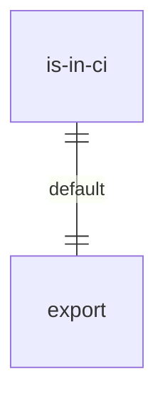
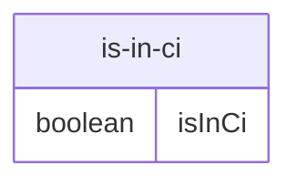

# is-in-ci.ts

这是一个替换 `is-in-ci` 包的补丁文件，用于解决在 CI 环境中 `ink` UI 无法正确渲染的问题。

## 功能概述

1. 定义一个常量 `isInCi` 并将其设置为 `false`
2. 导出该常量作为默认导出
3. 通过始终返回 `false` 来覆盖原 `is-in-ci` 包的行为

## 设计原因

- 避免 `ink` 在检测到 CI 环境时无法正确渲染 UI 的问题
- 这是安全的，因为 `ink`（以及 `is-in-ci`）仅在 CLI 的交互式代码路径中使用
- 参见 issue #1563 获取更多详细信息

## 主要变量

### isInCi
- 类型: `boolean`
- 值: `false`
- 用途: 替代原 `is-in-ci` 包的检测结果，始终表示不在 CI 环境中

## 函数级调用关系

## 变量级调用关系

