# BuiltinCommandLoader.ts

这个文件定义了 `BuiltinCommandLoader` 类，用于加载 Gemini CLI 应用程序的核心内置斜杠命令。

## 功能概述

1. 导入所有内置的斜杠命令
2. 实现 `ICommandLoader` 接口
3. 提供加载所有内置命令的方法

## 类和方法

### BuiltinCommandLoader
- 实现 `ICommandLoader` 接口
- 构造函数接收一个可选的 `Config` 对象
- `loadCommands` 方法异步加载所有内置命令并返回 `SlashCommand` 数组

## 依赖关系

- 依赖 `@google/gemini-cli-core` 中的 `Config` 类型
- 依赖 `./types.js` 中的 `ICommandLoader` 接口
- 依赖 `../ui/commands/types.js` 中的 `SlashCommand` 类型
- 导入所有内置命令模块

## 函数级调用关系

```mermaid
erDiagram
    BuiltinCommandLoader ||--|| ICommandLoader : implements
    BuiltinCommandLoader ||--|| Config : uses
    BuiltinCommandLoader ||--|| SlashCommand : uses
    BuiltinCommandLoader ||--|| loadCommands : method
    loadCommands ||--|| aboutCommand : imports
    loadCommands ||--|| authCommand : imports
    loadCommands ||--|| bugCommand : imports
    loadCommands ||--|| chatCommand : imports
    loadCommands ||--|| clearCommand : imports
    loadCommands ||--|| compressCommand : imports
    loadCommands ||--|| copyCommand : imports
    loadCommands ||--|| corgiCommand : imports
    loadCommands ||--|| docsCommand : imports
    loadCommands ||--|| directoryCommand : imports
    loadCommands ||--|| editorCommand : imports
    loadCommands ||--|| extensionsCommand : imports
    loadCommands ||--|| helpCommand : imports
    loadCommands ||--|| ideCommand : imports
    loadCommands ||--|| initCommand : imports
    loadCommands ||--|| mcpCommand : imports
    loadCommands ||--|| memoryCommand : imports
    loadCommands ||--|| privacyCommand : imports
    loadCommands ||--|| quitCommand : imports
    loadCommands ||--|| restoreCommand : imports
    loadCommands ||--|| statsCommand : imports
    loadCommands ||--|| themeCommand : imports
    loadCommands ||--|| toolsCommand : imports
    loadCommands ||--|| settingsCommand : imports
    loadCommands ||--|| vimCommand : imports
    loadCommands ||--|| setupGithubCommand : imports
    loadCommands ||--|| terminalSetupCommand : imports
```



## 变量级调用关系

```mermaid
erDiagram
    BuiltinCommandLoader {
        Config | null config
    }
    loadCommands {
        Array~SlashCommand | null~ allDefinitions
    }
```