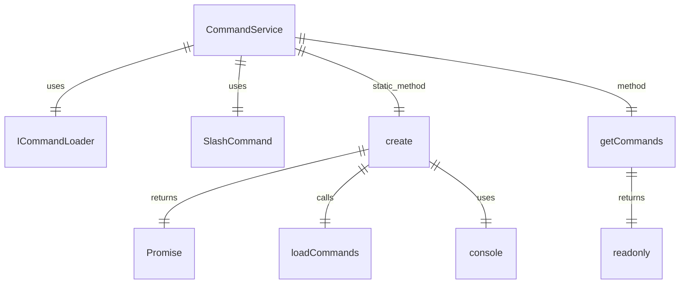

# CommandService.ts

这个文件定义了 `CommandService` 类，用于协调和管理 CLI 中所有斜杠命令的发现和加载。

## 功能概述

1. 实现命令加载器的编排和管理
2. 处理命令名称冲突
3. 提供统一的命令访问接口

## 类和方法

### CommandService
- 使用提供者模式的命令加载器架构
- 私有构造函数，强制使用异步工厂方法创建实例
- `create` 静态方法用于异步创建和初始化服务实例
- `getCommands` 方法用于获取加载的命令列表

## 设计模式

- 工厂模式：通过 `create` 静态方法创建实例
- 提供者模式：支持多种命令加载器
- 冲突解决机制：处理命令名称重复问题

## 冲突解决策略

1. 扩展命令与现有命令冲突时重命名为 `extensionName.commandName`
2. 非扩展命令（内置、用户、项目）根据加载器顺序覆盖同名命令

## 函数级调用关系



## 变量级调用关系

```mermaid
erDiagram
    CommandService {
        readonly SlashCommand[] commands
    }
    create {
        PromiseSettledResult~SlashCommand[]~[] results
        SlashCommand[] allCommands
        Map~string,SlashCommand~ commandMap
        string finalName
        string renamedName
        number suffix
        readonly SlashCommand[] finalCommands
    }
    getCommands {
        readonly SlashCommand[] commands
    }
```