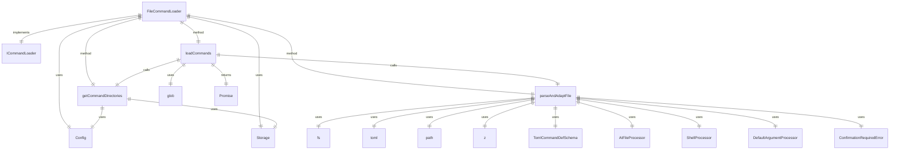

# FileCommandLoader.ts

这个文件定义了 `FileCommandLoader` 类，用于从 `.toml` 文件中发现和加载自定义斜杠命令。

## 功能概述

1. 从用户全局配置目录和当前项目目录中递归扫描命令目录
2. 解析和验证 TOML 文件
3. 将有效的定义适配为可执行的 `SlashCommand` 对象
4. 优雅地处理文件系统错误和格式错误的文件

## 类和方法

### FileCommandLoader
- 实现 `ICommandLoader` 接口
- 构造函数接收一个可选的 `Config` 对象
- `loadCommands` 方法异步加载所有命令并返回 `SlashCommand` 数组
- `getCommandDirectories` 私有方法获取所有命令目录
- `parseAndAdaptFile` 私有方法解析单个 `.toml` 文件并转换为 `SlashCommand` 对象

## 依赖关系

- 使用 `@iarna/toml` 解析 TOML 文件
- 使用 `glob` 查找命令文件
- 使用 `zod` 验证命令定义
- 依赖 `@google/gemini-cli-core` 中的 `Config` 和 `Storage`
- 依赖 `./types.js` 中的 `ICommandLoader` 接口
- 依赖 `../ui/commands/types.js` 中的类型定义
- 依赖 `./prompt-processors` 中的处理器

## 加载顺序

1. 用户命令
2. 项目命令
3. 扩展命令（按字母顺序排列）

## 函数级调用关系



## 变量级调用关系

```mermaid
erDiagram
    FileCommandLoader {
        readonly string projectRoot
        readonly boolean folderTrustEnabled
        readonly boolean folderTrust
        readonly Config | null config
    }
    loadCommands {
        SlashCommand[] allCommands
        object globOptions
        CommandDirectory[] commandDirs
        string[] files
        Promise~SlashCommand~[] commandPromises
        SlashCommand[] commands
    }
    getCommandDirectories {
        CommandDirectory[] dirs
        Storage storage
    }
    parseAndAdaptFile {
        string fileContent
        unknown parsed
        string relativePathWithExt
        string relativePath
        string baseCommandName
        string defaultDescription
        string description
        IPromptProcessor[] processors
        boolean usesArgs
        boolean usesShellInjection
        boolean usesAtFileInjection
        PromptPipelineContent processedContent
    }
    TomlCommandDefSchema {
        ZodObject schema
    }
```