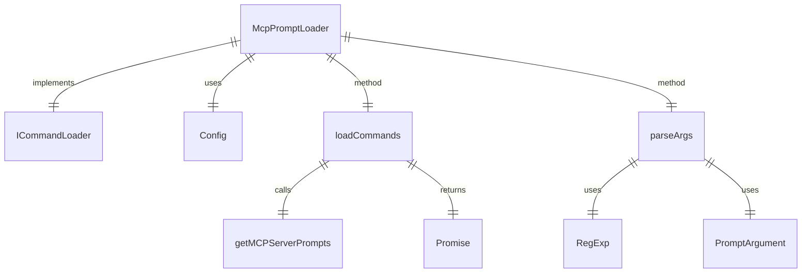

# McpPromptLoader.ts

这个文件定义了 `McpPromptLoader` 类，用于从 Model-Context-Protocol (MCP) 服务器公开的提示中发现和加载可执行的斜杠命令。

## 功能概述

1. 从所有配置的 MCP 服务器加载可用的提示
2. 将这些提示适配为可执行的 `SlashCommand` 对象
3. 提供参数解析功能

## 类和方法

### McpPromptLoader
- 实现 `ICommandLoader` 接口
- 构造函数接收一个可选的 `Config` 对象
- `loadCommands` 方法加载所有 MCP 提示并转换为 `SlashCommand` 数组
- `parseArgs` 方法解析用户提供的参数字符串

## 依赖关系

- 依赖 `@google/gemini-cli-core` 中的 `Config` 类型和 `getMCPServerPrompts`、`getErrorMessage` 函数
- 依赖 `../ui/commands/types.js` 中的类型定义
- 依赖 `./types.js` 中的 `ICommandLoader` 接口
- 依赖 `@modelcontextprotocol/sdk/types.js` 中的 `PromptArgument` 类型

## 参数解析

支持两种参数格式：
1. 命名参数：`--key="value"` 或 `--key=value`
2. 位置参数：按顺序提供参数值

## 函数级调用关系



## 变量级调用关系

```mermaid
erDiagram
    McpPromptLoader {
        readonly Config | null config
    }
    loadCommands {
        SlashCommand[] promptCommands
        object mcpServers
        string serverName
        Array~unknown~ prompts
        string commandName
        SlashCommand newPromptCommand
    }
    parseArgs {
        object argValues
        Record~string,unknown~ promptInputs
        RegExp namedArgRegex
        RegExpMatchArray | null match
        number lastIndex
        string[] positionalParts
        string positionalArgsString
        RegExp positionalArgRegex
        string[] positionalArgs
        PromptArgument[] unfilledArgs
        string[] missingArgs
        string missingArgNames
    }
```