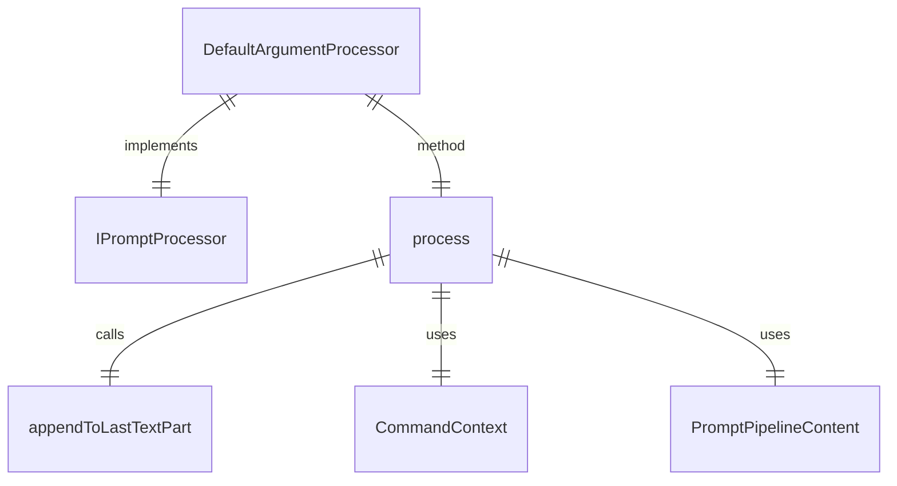
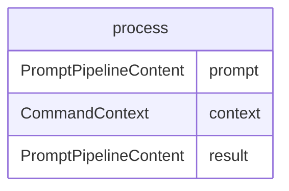

# argumentProcessor.ts

这个文件定义了 `DefaultArgumentProcessor` 类，用于在提示中不包含 `{{args}}` 时将用户的完整命令调用附加到提示中。

## 功能概述

1. 实现 `IPromptProcessor` 接口
2. 在提示不包含 `{{args}}` 时附加用户命令参数
3. 允许模型执行自己的参数解析

## 类和方法

### DefaultArgumentProcessor
- 实现 `IPromptProcessor` 接口
- `process` 方法处理提示内容并附加命令参数

## 依赖关系

- 依赖 `@google/gemini-cli-core` 中的 `appendToLastTextPart` 函数
- 依赖 `./types.js` 中的 `IPromptProcessor` 接口和 `PromptPipelineContent` 类型
- 依赖 `../../ui/commands/types.js` 中的 `CommandContext` 类型

## 使用条件

仅在提示不包含 `{{args}}` 占位符时使用此处理器。

## 函数级调用关系

## 变量级调用关系

