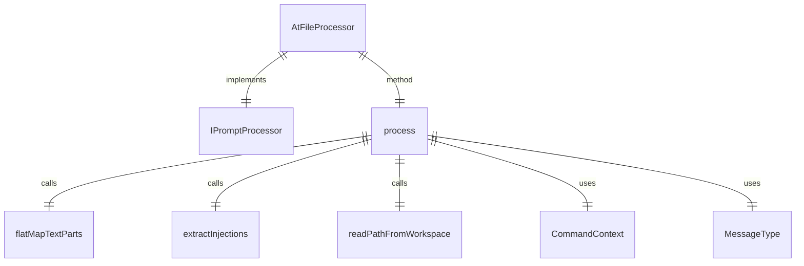

# atFileProcessor.ts

这个文件定义了 `AtFileProcessor` 类，用于处理提示中的文件注入（@{file} 语法）。

## 功能概述

1. 实现 `IPromptProcessor` 接口
2. 解析和注入 `@{file}` 语法引用的文件内容
3. 处理文件读取错误和忽略文件的情况

## 类和方法

### AtFileProcessor
- 实现 `IPromptProcessor` 接口
- 构造函数接收可选的命令名称
- `process` 方法处理提示内容并注入文件内容

## 依赖关系

- 依赖 `@google/gemini-cli-core` 中的 `flatMapTextParts` 和 `readPathFromWorkspace` 函数
- 依赖 `../../ui/commands/types.js` 中的 `CommandContext` 类型
- 依赖 `../../ui/types.js` 中的 `MessageType` 枚举
- 依赖 `./types.js` 中的类型定义
- 依赖 `./injectionParser.js` 中的 `extractInjections` 函数

## 处理逻辑

1. 查找文本中的 `@{file}` 注入点
2. 提取文件路径并读取内容
3. 将文件内容替换到提示中
4. 处理错误情况并显示相应消息

## 函数级调用关系



## 变量级调用关系

```mermaid
erDiagram
    AtFileProcessor {
        readonly string | undefined commandName
    }
    process {
        PromptPipelineContent input
        CommandContext context
        Config config
        PromptPipelineContent result
        string text
        Injection[] injections
        PromptPipelineContent output
        number lastIndex
        Injection injection
        string prefix
        string pathStr
        Array~unknown~ fileContentParts
        string uiMessage
        string message
        string suffix
    }
```