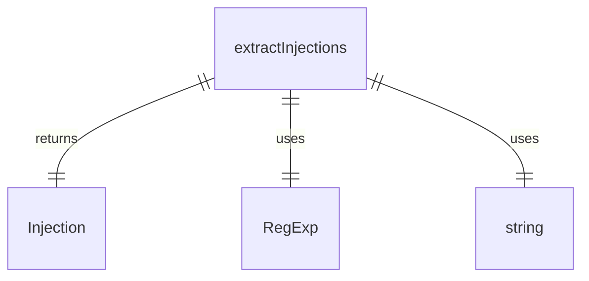

# injectionParser.ts

这个文件提供了注入解析功能，用于解析提示字符串中的注入点（如 `!{...}` 或 `@{...}`）。

## 功能概述

1. 定义 `Injection` 接口表示注入点
2. 提供 `extractInjections` 函数解析提示字符串中的注入点
3. 正确处理嵌套的大括号

## 接口和函数

### Injection
- 表示检测到的注入点
- 包含内容、起始索引和结束索引

### extractInjections
- 解析提示字符串以提取注入点
- 支持嵌套大括号处理
- 不支持转义字符
- 如果发现未闭合的注入点会抛出错误

## 解析逻辑

1. 查找触发序列（如 `!{` 或 `@{`）
2. 使用大括号计数法处理嵌套
3. 提取注入内容并创建 `Injection` 对象
4. 验证所有注入点都正确闭合

## 函数级调用关系



## 变量级调用关系

```mermaid
erDiagram
    Injection {
        string content
        number startIndex
        number endIndex
    }
    extractInjections {
        string prompt
        string trigger
        string | undefined contextName
        Injection[] injections
        number index
        number startIndex
        number currentIndex
        number braceCount
        boolean foundEnd
        string char
        string injectionContent
        number endIndex
        string contextInfo
    }
```