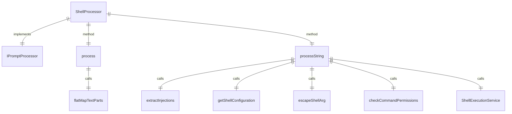

# shellProcessor.ts

这个文件定义了 `ShellProcessor` 类，用于处理提示中的 shell 命令执行（`!{...}`）和上下文感知的参数注入（`{{args}}`）。

## 功能概述

1. 实现 `IPromptProcessor` 接口
2. 处理 shell 命令注入和参数替换
3. 确保安全执行 shell 命令
4. 正确处理嵌套的大括号

## 类和方法

### ConfirmationRequiredError
- 自定义错误类，用于需要用户确认的 shell 命令

### ShellProcessor
- 实现 `IPromptProcessor` 接口
- 构造函数接收命令名称
- `process` 方法处理提示内容
- `processString` 私有方法处理字符串内容

## 依赖关系

- 依赖 `@google/gemini-cli-core` 中的多个安全和执行函数
- 依赖 `../../ui/commands/types.js` 中的 `CommandContext` 类型
- 依赖 `./types.js` 中的类型定义
- 依赖 `./injectionParser.js` 中的 `extractInjections` 函数

## 处理逻辑

1. 解析 `!{...}` 注入点
2. 替换 `{{args}}` 占位符（外部为原始输入，内部为转义输入）
3. 安全检查 shell 命令权限
4. 执行允许的 shell 命令并获取输出
5. 将命令输出插入到提示中

## 函数级调用关系



## 变量级调用关系

```mermaid
erDiagram
    ShellProcessor {
        readonly string commandName
    }
    ConfirmationRequiredError {
        string message
        string[] commandsToConfirm
    }
    processString {
        string prompt
        CommandContext context
        string userArgsRaw
        Config config
        Set~string~ sessionShellAllowlist
        Injection[] injections
        string shell
        string userArgsEscaped
        ResolvedShellInjection[] resolvedInjections
        Set~string~ commandsToConfirm
        string processedPrompt
        number lastIndex
        Injection injection
        string command
        object permissions
        boolean allAllowed
        string[] disallowedCommands
        string blockReason
        boolean isHardDenial
        string segment
        string finalSegment
    }
```