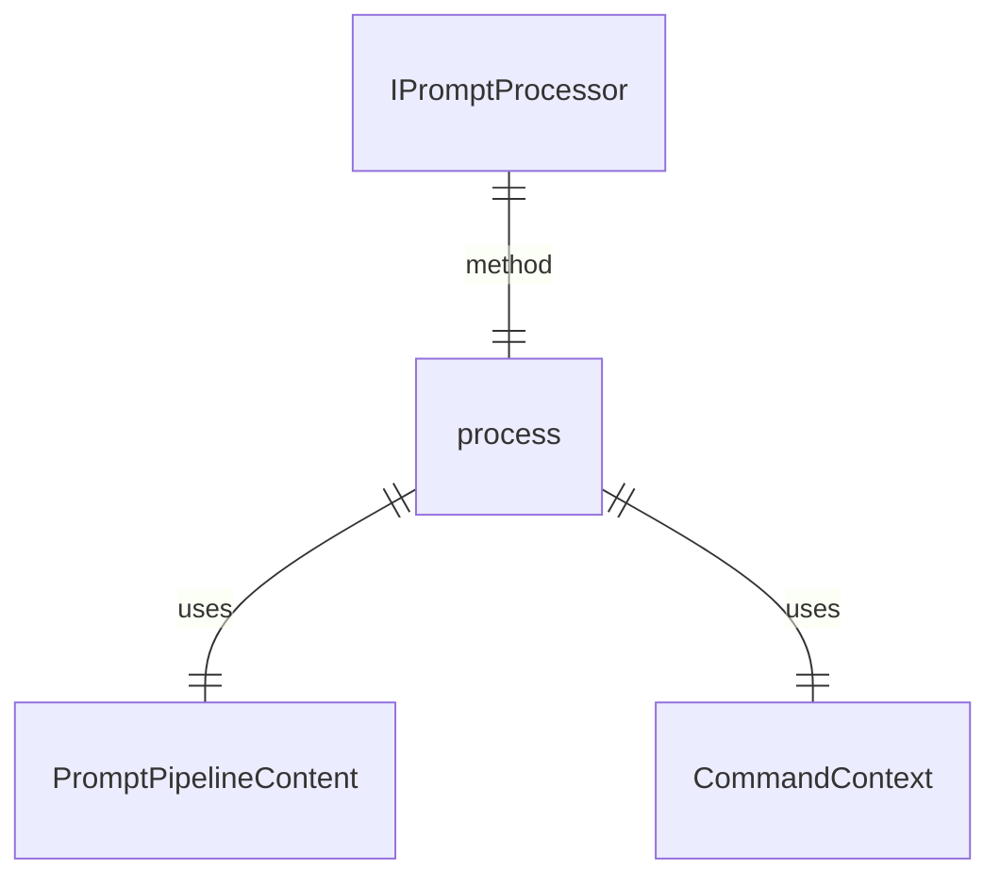
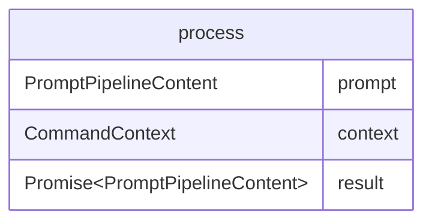

# types.ts

这个文件定义了提示处理器的类型和接口，以及相关的常量。

## 功能概述

1. 定义提示管道内容类型
2. 定义提示处理器接口
3. 定义提示处理中使用的常量

## 类型和接口

### PromptPipelineContent
- 定义提示处理器的输入/输出类型
- 基于 `@google/genai` 中的 `PartUnion[]` 类型

### IPromptProcessor
- 定义提示处理器的接口
- 包含 `process` 方法用于转换提示内容

## 常量定义

### SHORTHAND_ARGS_PLACEHOLDER
- 简写参数注入的占位符字符串 `{{args}}`
- 在 `!{...}` 外部使用时参数按原样注入
- 在 `!{...}` 内部使用时参数进行 shell 转义

### SHELL_INJECTION_TRIGGER
- shell 命令注入的触发字符串 `!{`

### AT_FILE_INJECTION_TRIGGER
- 文件注入的触发字符串 `@{`

## 函数级调用关系

## 变量级调用关系

