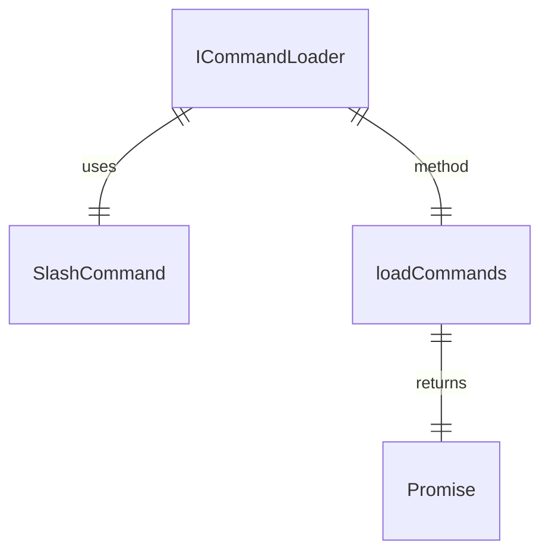
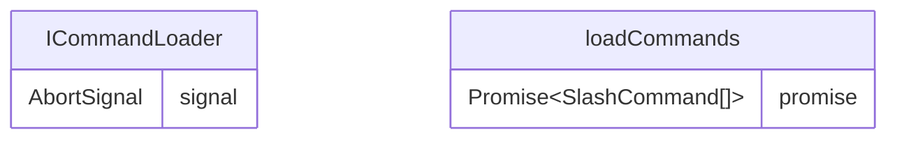

# types.ts

这个文件定义了命令加载器的接口，允许 `CommandService` 扩展新的命令源而无需修改。

## 功能概述

1. 定义 `ICommandLoader` 接口
2. 为命令加载器提供统一的契约

## 接口定义

### ICommandLoader
- 定义了命令加载器的契约
- 包含 `loadCommands` 方法用于发现和返回斜杠命令列表
- 支持通过 `AbortSignal` 取消加载过程

## 设计原则

- 开放封闭原则：允许扩展新的命令源而无需修改现有代码
- 依赖注入：加载器应通过构造函数接收必要的依赖（如 Config）

## 函数级调用关系

## 变量级调用关系

