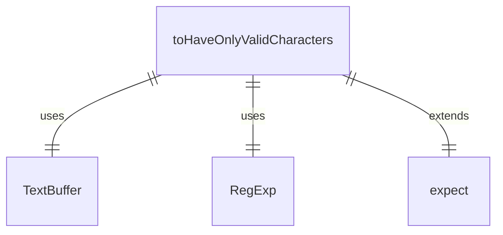
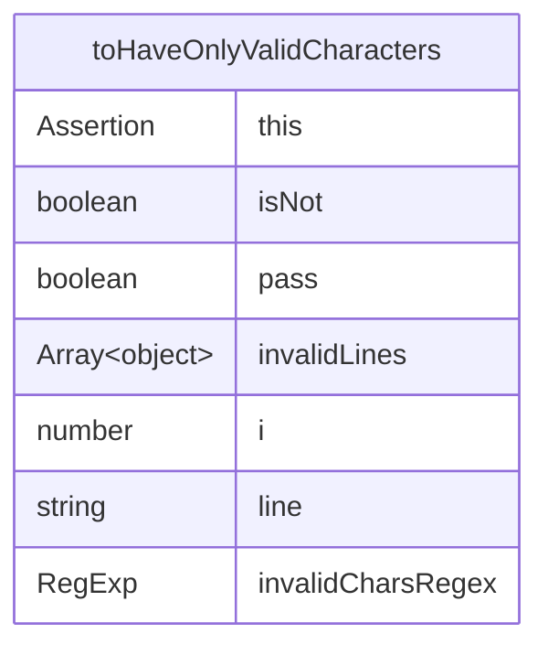

# customMatchers.ts

这个文件定义了自定义的 Vitest 匹配器，用于测试中验证文本缓冲区的有效字符。

## 功能概述

1. 定义 `toHaveOnlyValidCharacters` 自定义匹配器
2. 扩展 Vitest 的 `expect` 接口
3. 检测文本缓冲区中的无效字符

## 匹配器函数

### toHaveOnlyValidCharacters
- 检查 `TextBuffer` 对象是否只包含有效字符
- 检测无效字符：退格符和 ANSI 转义码
- 检测换行符（`\n`）
- 返回详细的错误信息，包括包含无效字符的行号和内容

## 依赖关系

- 依赖 `vitest` 进行测试断言
- 依赖 `../ui/components/shared/text-buffer.js` 中的 `TextBuffer` 类型

## 正则表达式

使用正则表达式 `/[\b\x1b]/` 检测退格符和 ANSI 转义码。

## 函数级调用关系

## 变量级调用关系

