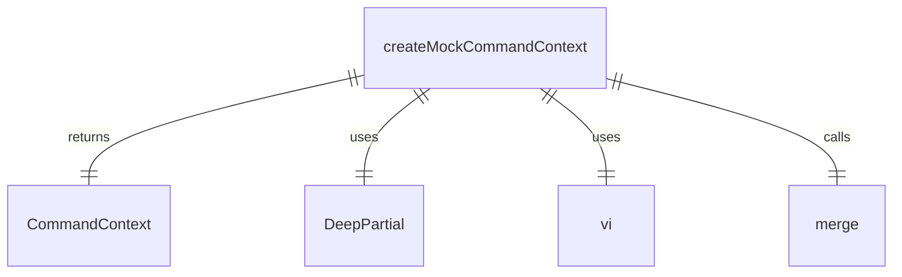
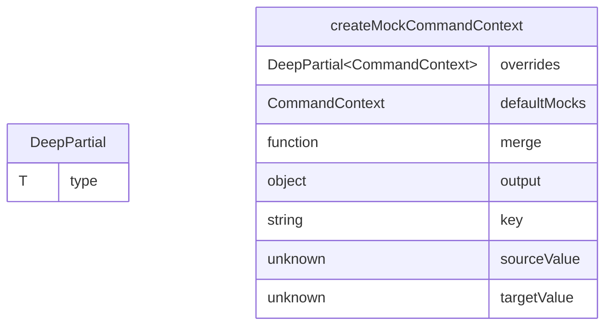

# mockCommandContext.ts

这个文件提供了创建 `CommandContext` 模拟对象的工具函数，用于测试中。

## 功能概述

1. 定义 `DeepPartial` 工具类型
2. 提供 `createMockCommandContext` 函数创建完整的模拟上下文对象
3. 预先模拟所有函数以便于测试

## 工具类型

### DeepPartial
- 使对象及其嵌套对象的所有属性变为可选
- 递归处理嵌套对象

## 主要函数

### createMockCommandContext
- 创建深度、完全类型的 `CommandContext` 模拟对象
- 所有函数都预先用 `vi.fn()` 模拟
- 接受 `overrides` 参数以覆盖默认模拟值

## 依赖关系

- 依赖 `vitest` 中的 `vi` 进行函数模拟
- 依赖 `../ui/commands/types.js` 中的 `CommandContext` 类型
- 依赖 `../config/settings.js` 中的 `LoadedSettings` 类型
- 依赖 `@google/gemini-cli-core` 中的 `GitService` 类型
- 依赖 `../ui/contexts/SessionContext.js` 中的 `SessionStatsState` 类型

## 合并逻辑

使用自定义的 `merge` 函数递归合并默认模拟值和覆盖值，确保正确处理对象和特殊类型（如 Date）。

## 函数级调用关系

## 变量级调用关系

