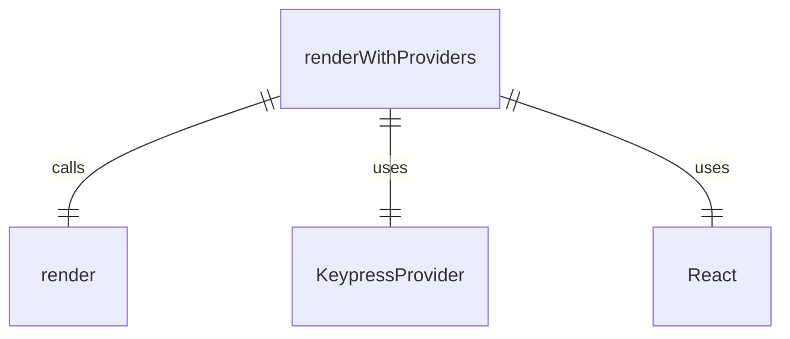

# render.tsx

这个文件提供了一个带提供者的渲染函数，用于测试 React 组件。

## 功能概述

1. 导出 `renderWithProviders` 函数
2. 使用 `ink-testing-library` 的 `render` 函数
3. 包装组件以提供必要的上下文

## 主要函数

### renderWithProviders
- 接受一个 React 元素作为参数
- 使用 `KeypressProvider` 包装组件
- 返回 `ink-testing-library` 的 `render` 函数结果

## 依赖关系

- 依赖 `ink-testing-library` 中的 `render` 函数
- 依赖 `react` 类型定义
- 依赖 `../ui/contexts/KeypressContext.js` 中的 `KeypressProvider` 组件

## 函数级调用关系



## 变量级调用关系

```mermaid
erDiagram
    renderWithProviders {
        React.ReactElement component
        boolean kittyProtocolEnabled
    }
```