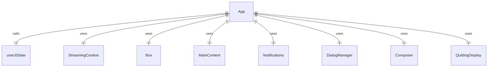
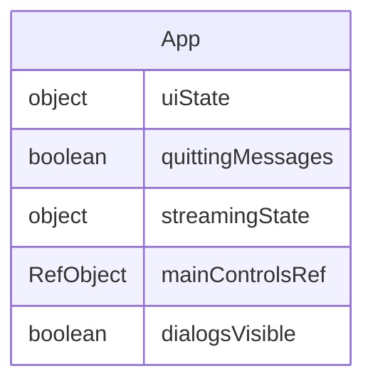

# App.tsx

这个文件定义了 CLI 应用程序的主 UI 组件。

## 功能概述

1. 导出 `App` 组件作为应用程序的根组件
2. 管理应用程序的主要 UI 布局
3. 根据应用程序状态显示不同界面

## 组件结构

### App
- 使用 `useUIState` 钩子获取 UI 状态
- 根据 `quittingMessages` 状态显示退出界面或主界面
- 使用 `StreamingContext.Provider` 提供流状态上下文
- 主要包含以下子组件：
  - `MainContent`：主要内容区域
  - `Notifications`：通知区域
  - `DialogManager` 或 `Composer`：对话框管理器或输入组件

## 依赖关系

- 依赖 `ink` 中的 `Box` 组件
- 依赖 `./contexts/StreamingContext.js` 中的 `StreamingContext`
- 依赖 `./components/Notifications.js` 中的 `Notifications` 组件
- 依赖 `./components/MainContent.js` 中的 `MainContent` 组件
- 依赖 `./components/DialogManager.js` 中的 `DialogManager` 组件
- 依赖 `./components/Composer.js` 中的 `Composer` 组件
- 依赖 `./contexts/UIStateContext.js` 中的 `useUIState` 钩子
- 依赖 `./components/QuittingDisplay.js` 中的 `QuittingDisplay` 组件

## 条件渲染

- 当 `uiState.quittingMessages` 存在时，显示 `QuittingDisplay`
- 否则显示主应用程序界面

## 函数级调用关系

## 变量级调用关系

