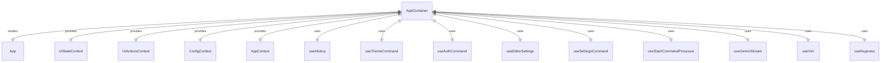

# AppContainer.tsx

这个文件定义了 CLI 应用程序的主容器组件，负责管理应用程序的全局状态和上下文。

## 功能概述

1. 导出 `AppContainer` 组件作为应用程序的根容器
2. 管理应用程序的全局状态
3. 提供各种上下文给子组件
4. 处理键盘事件和用户交互
5. 管理应用程序的生命周期

## 组件结构

### AppContainer
- 接受 `config`、`settings`、`startupWarnings`、`version` 和 `initializationResult` 作为属性
- 使用大量 React 钩子管理状态和副作用
- 提供多个上下文：
  - `UIStateContext`：UI 状态上下文
  - `UIActionsContext`：UI 操作上下文
  - `ConfigContext`：配置上下文
  - `AppContext`：应用程序上下文
- 渲染 `App` 组件

## 依赖关系

- 依赖 React 的各种钩子（useState、useCallback、useEffect 等）
- 依赖 `ink` 中的 `useStdin`、`useStdout`、`useTerminalSize` 等钩子
- 依赖 `./App.js` 中的 `App` 组件
- 依赖多个上下文文件（`./contexts/*.js`）
- 依赖多个钩子文件（`./hooks/*.js`）
- 依赖 `@google/gemini-cli-core` 中的多个工具函数和类型
- 依赖 `../config/*.js` 中的配置相关文件
- 依赖 `../core/initializer.js` 中的初始化结果类型

## 主要状态管理

1. 认证状态管理
2. 主题状态管理
3. 编辑器设置管理
4. 流状态管理
5. 历史记录管理
6. 控制台消息管理
7. 键盘事件处理
8. IDE 集成状态管理

## 函数级调用关系



## 变量级调用关系

```mermaid
erDiagram
    AppContainer {
        AppContainerProps props
        object settings
        Config config
        InitializationResult initializationResult
        object historyManager
        boolean corgiMode
        string debugMessage
        HistoryItem[] | null quittingMessages
        boolean showPrivacyNotice
        string | null themeError
        boolean isProcessing
        number geminiMdFileCount
        boolean shellModeActive
        boolean modelSwitchedFromQuotaError
        number historyRemountKey
        UpdateObject | null updateInfo
        boolean | undefined isTrustedFolder
        string currentModel
        UserTierId | undefined userTier
        boolean isProQuotaDialogOpen
        ((value: boolean) => void) | null proQuotaDialogResolver
        object logger
        string[] userMessages
        number terminalWidth
        number terminalHeight
        object stdin
        object stdout
        object sessionStats
        string branchName
        RefObject~DOMElement~ mainControlsRef
        number staticExtraHeight
        boolean showAutoAcceptIndicator
        string[] consoleMessages
        number widthFraction
        number inputWidth
        number suggestionsWidth
        number mainAreaWidth
        number staticAreaMaxItemHeight
        TextBuffer buffer
        boolean isValidPath
        boolean refreshStatic
        object themeCommand
        object authCommand
        AuthState authState
        string authError
        boolean isAuthDialogOpen
        boolean isAuthenticating
        boolean handleAuthSelect
        string | null editorError
        object editorSettings
        object settingsCommand
        object workspaceMigration
        object toggleVimEnabled
        object slashCommandActions
        object slashCommandProcessor
        boolean performMemoryRefresh
        RefObject~() => void~ cancelHandlerRef
        object geminiStream
        object messageQueue
        boolean handleFinalSubmit
        boolean handleClearScreen
        boolean handleProQuotaChoice
        object vim
        boolean isInputActive
        number availableTerminalHeight
        boolean isFocused
        string[] contextFileNames
        string initialPrompt
        RefObject~boolean~ initialPromptSubmitted
        GeminiClient geminiClient
        boolean idePromptAnswered
        DetectedIde | null currentIDE
        boolean showErrorDetails
        boolean showToolDescriptions
        boolean ctrlCPressedOnce
        RefObject~NodeJS.Timeout | null~ ctrlCTimerRef
        boolean ctrlDPressedOnce
        RefObject~NodeJS.Timeout | null~ ctrlDTimerRef
        boolean constrainHeight
        IdeContext | undefined ideContextState
        boolean showEscapePrompt
        boolean showIdeRestartPrompt
        object folderTrust
        boolean ideNeedsRestart
        RefObject~boolean~ isInitialMount
        boolean handleEscapePromptChange
        boolean handleIdePromptComplete
        object loadingIndicator
        boolean handleExit
        boolean handleGlobalKeypress
        object[] filteredConsoleMessages
        number errorCount
        boolean nightly
        boolean dialogsVisible
        HistoryItemWithoutId[] pendingHistoryItems
        UIState uiState
        UIActions uiActions
    }
```