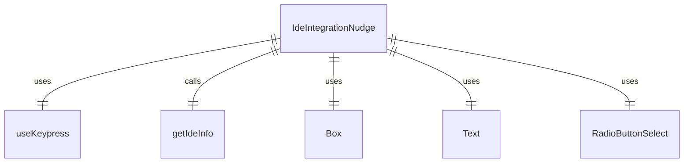

# IdeIntegrationNudge.tsx

这个文件定义了 IDE 集成提示组件，用于询问用户是否要连接其 IDE 到 Gemini CLI。

## 功能概述

1. 导出 `IdeIntegrationNudge` 组件
2. 导出 `IdeIntegrationNudgeResult` 类型
3. 提供用户选择是否集成 IDE 的界面

## 组件结构

### IdeIntegrationNudge
- 接受 `ide` 和 `onComplete` 作为属性
- 使用 `useKeypress` 钩子处理键盘事件
- 显示关于 IDE 集成的提示信息
- 提供单选按钮供用户选择

## 类型定义

### IdeIntegrationNudgeResult
- `userSelection`：用户选择（'yes' | 'no' | 'dismiss'）
- `isExtensionPreInstalled`：扩展是否已预安装

## 依赖关系

- 依赖 `@google/gemini-cli-core` 中的 `DetectedIde` 类型和 `getIdeInfo` 函数
- 依赖 `ink` 中的 `Box` 和 `Text` 组件
- 依赖 `./components/shared/RadioButtonSelect.js` 中的 `RadioButtonSelect` 组件和 `RadioSelectItem` 类型
- 依赖 `./hooks/useKeypress.js` 中的 `useKeypress` 钩子

## 用户交互

1. 按 ESC 键选择 "No"
2. 通过单选按钮选择 "Yes"、"No" 或 "No, don't ask again"
3. 根据选择调用 `onComplete` 回调函数

## 函数级调用关系



## 变量级调用关系

```mermaid
erDiagram
    IdeIntegrationNudge {
        DetectedIde ide
        function onComplete
        Key key
        object ideInfo
        string ideName
        boolean isExtensionPreInstalled
        RadioSelectItem~IdeIntegrationNudgeResult~[] OPTIONS
        string installText
    }
    IdeIntegrationNudgeResult {
        "yes" | "no" | "dismiss" userSelection
        boolean isExtensionPreInstalled
    }
```