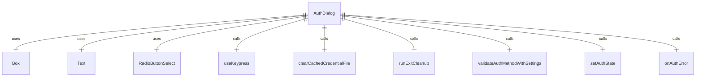
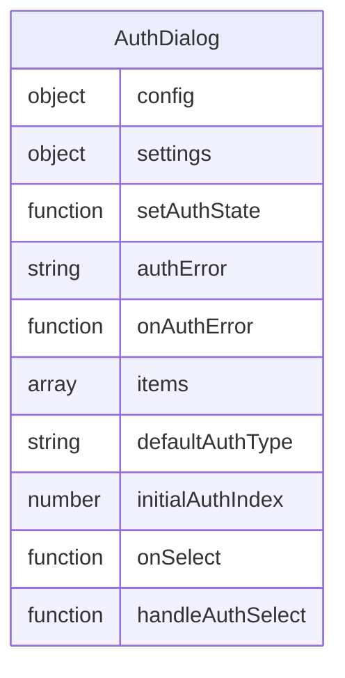

# AuthDialog.tsx

这个文件定义了一个认证对话框组件，用于让用户选择认证方式。

## 功能概述

1. 显示认证选项供用户选择
2. 根据环境变量和设置过滤认证选项
3. 处理用户选择的认证方式
4. 显示认证错误信息

## 组件结构

### AuthDialog
- 接收配置、设置、状态设置函数、错误信息和错误处理函数作为属性
- 根据环境变量和设置构建认证选项列表
- 根据默认设置或环境变量确定初始选中项
- 使用 `RadioButtonSelect` 组件显示认证选项
- 处理用户选择认证方式的逻辑
- 显示认证错误信息

## 依赖关系

- 依赖 `ink` 中的 `Box` 和 `Text` 组件
- 依赖 `../colors.js` 中的 `Colors`
- 依赖 `../components/shared/RadioButtonSelect.js` 中的 `RadioButtonSelect`
- 依赖 `../../config/settings.js` 中的 `LoadedSettings` 和 `SettingScope`
- 依赖 `@google/gemini-cli-core` 中的 `AuthType` 和 `clearCachedCredentialFile`
- 依赖 `../hooks/useKeypress.js` 中的 `useKeypress`
- 依赖 `../types.js` 中的 `AuthState`
- 依赖 `../../utils/cleanup.js` 中的 `runExitCleanup`
- 依赖 `./useAuth.js` 中的 `validateAuthMethodWithSettings`

## 函数级调用关系

## 变量级调用关系

