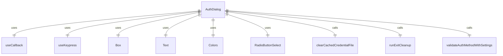

# AuthDialog.tsx

这个文件定义了认证对话框组件，用于用户选择认证方法。

## 功能概述

1. 导出 `AuthDialog` 组件
2. 提供认证方法选择界面
3. 处理认证方法的选择和验证
4. 显示认证错误信息

## 组件结构

### AuthDialog
- 接受 `config`、`settings`、`setAuthState`、`authError` 和 `onAuthError` 作为属性
- 使用 `useCallback` 钩子处理认证选择
- 使用 `useKeypress` 钩子处理键盘事件
- 显示认证方法选择的单选按钮
- 显示认证错误信息

## 依赖关系

- 依赖 React 的 `useCallback` 钩子
- 依赖 `ink` 中的 `Box` 和 `Text` 组件
- 依赖 `../colors.js` 中的 `Colors` 对象
- 依赖 `../components/shared/RadioButtonSelect.js` 中的 `RadioButtonSelect` 组件
- 依赖 `../../config/settings.js` 中的 `LoadedSettings` 类型和 `SettingScope` 枚举
- 依赖 `@google/gemini-cli-core` 中的 `AuthType` 枚举和 `Config` 类型
- 依赖 `../hooks/useKeypress.js` 中的 `useKeypress` 钩子
- 依赖 `../types.js` 中的 `AuthState` 枚举
- 依赖 `../../utils/cleanup.js` 中的 `runExitCleanup` 函数
- 依赖 `./useAuth.js` 中的 `validateAuthMethodWithSettings` 函数

## 认证方法

1. Login with Google
2. Use Cloud Shell user credentials（仅在 Cloud Shell 环境中显示）
3. Use Gemini API Key
4. Vertex AI

## 用户交互

1. 通过单选按钮选择认证方法
2. 按 ESC 键退出对话框（在特定条件下）
3. 显示认证错误信息
4. 显示服务条款和隐私声明链接

## 函数级调用关系



## 变量级调用关系

```mermaid
erDiagram
    AuthDialog {
        Config config
        LoadedSettings settings
        function setAuthState
        string | null authError
        function onAuthError
        Array~object~ items
        AuthType | null defaultAuthType
        string | undefined defaultAuthTypeEnv
        number initialAuthIndex
        function onSelect
        function handleAuthSelect
        Key key
        string error
    }
```