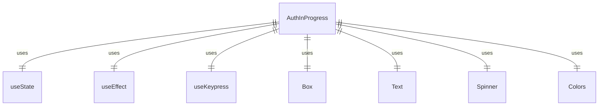

# AuthInProgress.tsx

这个文件定义了认证进行中组件，用于显示认证过程中的等待状态。

## 功能概述

1. 导出 `AuthInProgress` 组件
2. 显示认证进行中的加载状态
3. 处理认证超时
4. 提供取消认证的键盘快捷键

## 组件结构

### AuthInProgress
- 接受 `onTimeout` 回调函数作为属性
- 使用 `useState` 钩子管理超时状态
- 使用 `useEffect` 钩子设置超时定时器
- 使用 `useKeypress` 钩子处理键盘事件
- 显示加载动画和等待文本
- 在超时后显示错误信息

## 依赖关系

- 依赖 React 的 `useState` 和 `useEffect` 钩子
- 依赖 `ink` 中的 `Box` 和 `Text` 组件
- 依赖 `ink-spinner` 中的 `Spinner` 组件
- 依赖 `../colors.js` 中的 `Colors` 对象
- 依赖 `../hooks/useKeypress.js` 中的 `useKeypress` 钩子

## 用户交互

1. 按 ESC 键或 CTRL+C 组合键取消认证
2. 等待认证完成（最长 3 分钟）
3. 超时后显示错误信息

## 超时处理

- 设置 180000 毫秒（3 分钟）的超时定时器
- 超时后调用 `onTimeout` 回调函数
- 清除定时器以防止内存泄漏

## 函数级调用关系



## 变量级调用关系

```mermaid
erDiagram
    AuthInProgress {
        function onTimeout
        boolean timedOut
        function setTimedOut
        NodeJS.Timeout timer
        Key key
    }
```