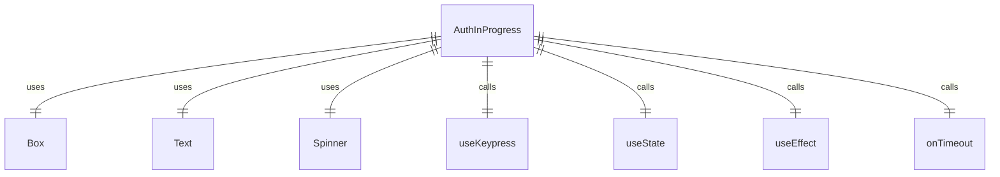

# AuthInProgress.tsx

这个文件定义了一个认证进行中的组件，用于显示认证过程中的状态。

## 功能概述

1. 显示认证进行中的状态
2. 提供取消认证的选项
3. 在认证超时时显示错误信息

## 组件结构

### AuthInProgress
- 接收超时处理函数作为属性
- 使用 `useState` 管理超时状态
- 使用 `useKeypress` 监听键盘事件以取消认证
- 使用 `useEffect` 设置超时定时器
- 显示认证进行中的状态或超时错误信息

## 依赖关系

- 依赖 `ink` 中的 `Box` 和 `Text` 组件
- 依赖 `ink-spinner` 中的 `Spinner`
- 依赖 `../colors.js` 中的 `Colors`
- 依赖 `../hooks/useKeypress.js` 中的 `useKeypress`

## 函数级调用关系



## 变量级调用关系

```mermaid
erDiagram
    AuthInProgress {
        function onTimeout
        boolean timedOut
        function setTimedOut
    }