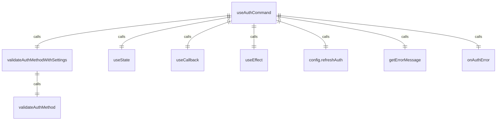
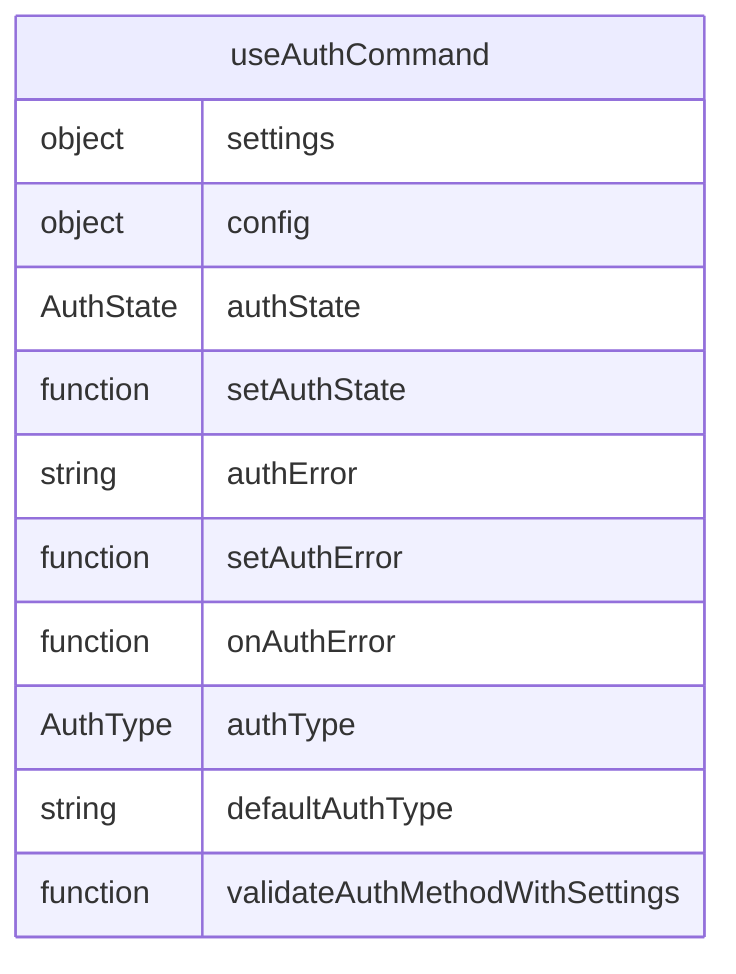

# useAuth.ts

这个文件定义了认证相关的 hooks，用于管理认证状态和错误处理。

## 功能概述

1. 验证认证方式是否符合设置要求
2. 管理认证状态和错误信息
3. 处理认证过程中的逻辑

## 函数结构

### validateAuthMethodWithSettings
- 接收认证类型和设置作为参数
- 验证认证类型是否符合设置中的强制要求
- 如果设置中指定了使用外部认证，则返回 null
- 否则调用 `validateAuthMethod` 进行验证

### useAuthCommand
- 接收设置和配置作为参数
- 使用 `useState` 管理认证状态和错误信息
- 使用 `useCallback` 定义错误处理函数
- 使用 `useEffect` 处理认证逻辑
- 返回认证状态、状态设置函数、错误信息和错误处理函数

## 依赖关系

- 依赖 `react` 中的 `useState`、`useEffect` 和 `useCallback`
- 依赖 `../../config/settings.js` 中的 `LoadedSettings`
- 依赖 `@google/gemini-cli-core` 中的 `AuthType` 和 `Config`
- 依赖 `@google/gemini-cli-core` 中的 `getErrorMessage`
- 依赖 `../types.js` 中的 `AuthState`
- 依赖 `../../config/auth.js` 中的 `validateAuthMethod`

## 函数级调用关系

## 变量级调用关系

